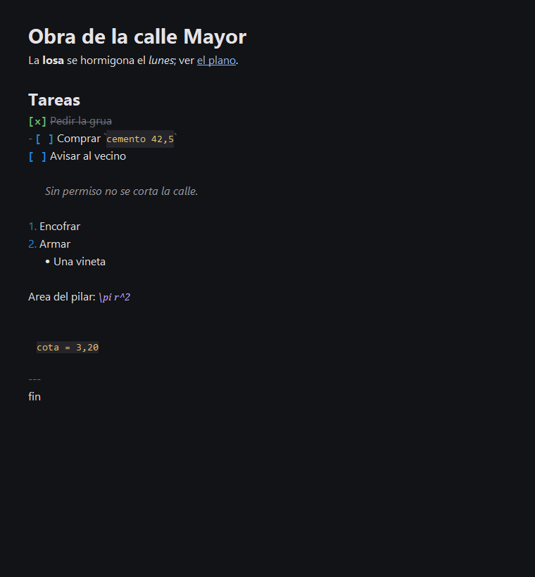
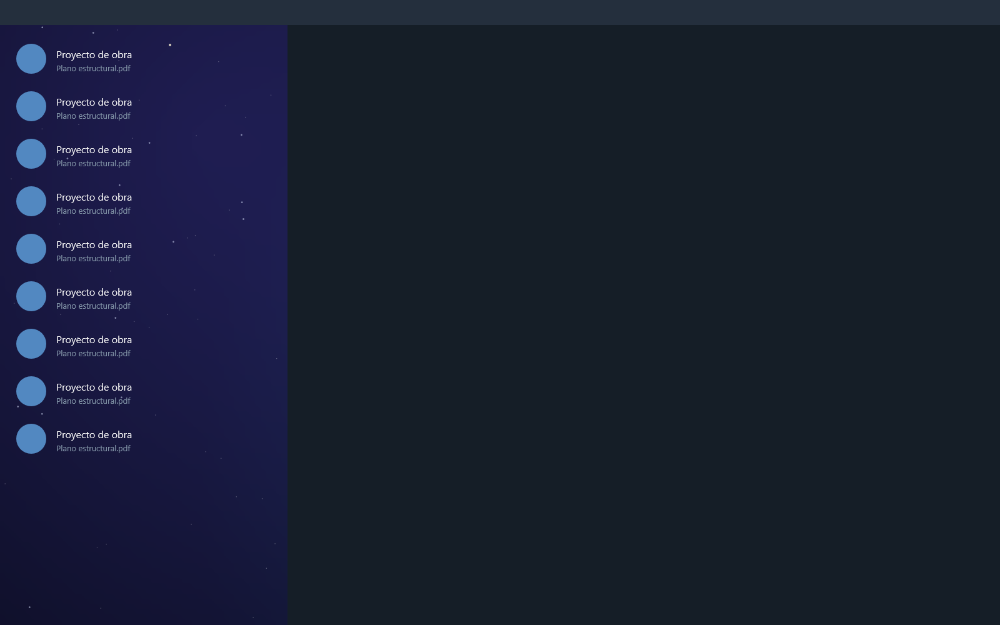
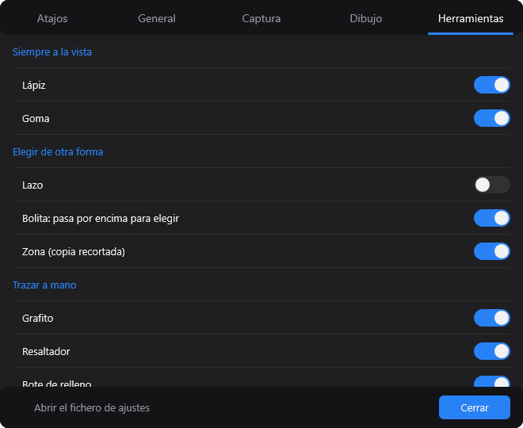
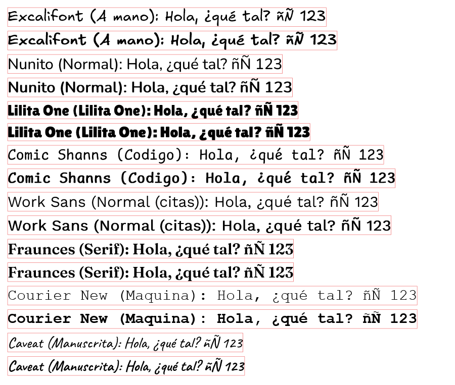
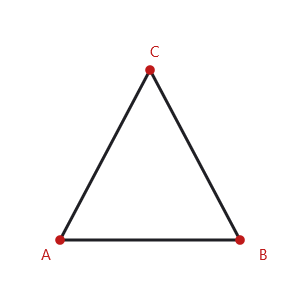
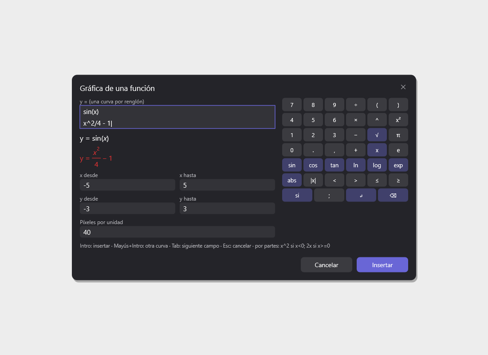
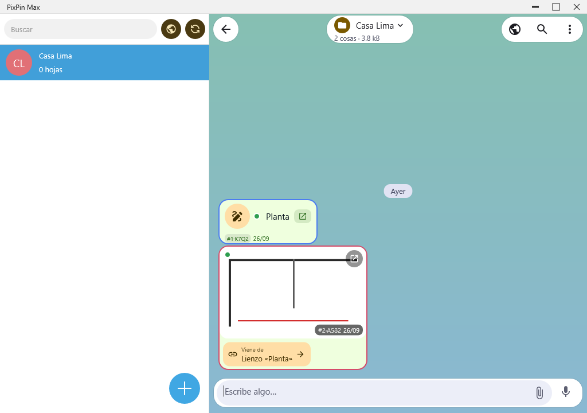
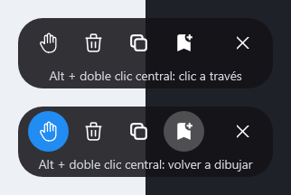
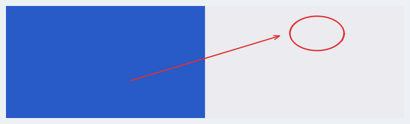
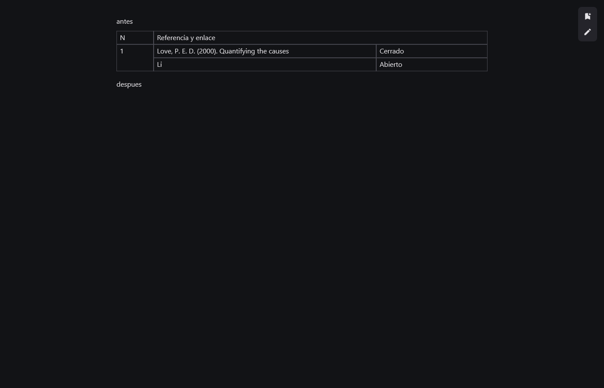

# PixPin Max para Windows

Captura, pines flotantes, lienzo de dibujo y proyectos para Windows 10 21H2 o superior.
Es el hermano de escritorio de **PixPin Android**: lee y escribe los mismos proyectos,
se sincroniza con el móvil por Wi-Fi y copia su forma de trabajar.

Escrito en Rust sobre lo que Windows ya trae (Direct2D, DirectWrite, DirectComposition,
Windows.Media.Ocr, WebView2). Sin cuentas, sin nube y sin telemetría. Pensado para
equipos modestos: la máquina de referencia es un Core i3 de 3.ª generación con 4 GB.

> El nombre **PixPin** pertenece a DepthPixel. Este proyecto es una implementación
> personal e independiente, igual que su versión Android.


## Descargar

La última versión está en [Releases](https://github.com/1xmanMAX/PIXPIN_PRO_WINDOWS/releases).
Descomprime el ZIP y ejecuta `pixpinmax.exe`. Se queda en la bandeja del sistema y
arranca con Windows. `pixpin-aligerar.exe` va al lado: es el compresor de PDF.

## Qué hace

### Proyectos y chat

Cada proyecto es un chat, como en el móvil: notas, fotos, notas de voz, documentos, PDF,
tablas y lienzos. Un interruptor en la barra de arriba cambia el panel derecho entre el
**chat** del proyecto y su **tarjeta**, que enseña la portada, las hojas en miniatura y los
botones para crear una hoja, una nota o una tabla. Con la ventana estrecha queda un solo
panel con un botón para volver a la lista.

| Ancha, clara | Ancha, oscura | Estrecha |
|---|---|---|
|  |  |  |

- **PDF**: un PDF entra en el chat como un solo mensaje. Sus páginas se hacen hojas del
  proyecto, se anotan como lienzos y se ven en la tarjeta, sin llenar el chat. Se lee
  seguido, con espacios para anotar a los lados, marcadores, búsqueda y fusión de páginas.
  El compresor (`pixpin-aligerar.exe`) lo aligera en segundo plano.
- **Documentos**: Word, EPUB, HTML, Markdown y texto se leen dentro, con zoom, marcadores
  y tinta encima. PowerPoint se presenta a pantalla completa. Excel entra como tablas que
  calculan.
- **Notas Markdown** con formato en vivo, casillas y corrector de Windows.

  

- **Voz**: notas de voz, transcripción con Whisper (sobre el ONNX Runtime de Windows),
  dos idiomas en una nota, teleprónter, pronunciar y conversación por turnos.
- **Lecciones aprendidas, galería de capturas y tareas**: tres botones junto a Sincronizar,
  como en el móvil. Las capturas se van a la papelera a los 7 días salvo las que se conservan.

| Tema Cosmos |
|---|
|  |

### El lienzo

Un puerto de Excalidraw con las herramientas del móvil. La barra va agrupada en una fila:
cada grupo enseña su última herramienta y despliega las demás. Todas se encienden y apagan
en **Ajustes → Herramientas**.

| Barra agrupada | Ajustes → Herramientas |
|---|---|
|  |  |

- **Texto sin caja**: clic y se escribe; el marco solo sale al elegirlo, a la medida real
  de lo escrito. Ocho letras incluidas: Excalifont, Nunito, Lilita One, Comic Shanns,
  Work Sans, Fraunces, Courier New y Caveat.

  

- **Tinta**: lápiz, grafito, resaltador con el trazo del móvil, goma y bote de relleno
  exacto entre figuras.
- **Construir**: recortar y extender rayas, soldar vértices (la figura gira sobre su clavo),
  puntos con letra, cotas que piden su medida, escala gráfica y calibrar.

| Soldar vértices | Puntos con letra |
|---|---|
|  |  |

- **Señalar y tapar**: pasos numerados de un clic, foco que oscurece alrededor de una
  figura, lupa con el dibujo ampliado dentro, pixelar o desenfocar (también en lo
  exportado), láser y marcadores.

| Pasos y foco | Pixelar | Lupa |
|---|---|---|
|  |  |  |

- **Gráficas, tablas y cronogramas**: gráfica de funciones con teclado de fórmulas, tablas
  editables (pegadas de Excel o Sheets, con celdas combinadas y negrita) y cronograma.

| Gráfica | Cajetín de la gráfica | Tabla |
|---|---|---|
|  |  |  |

- **Zona**: arrastra un rectángulo y sale una copia recortada; con «Al chat» va al chat del
  proyecto con su vínculo de vuelta al lienzo.

  

- **Marcos, imprimir y exportar**: cada marco es una página; se imprime con la vista previa
  de Windows y el número de página. Exporta a PNG, JPG, SVG, PDF y página web que se
  vuelve a anotar.
- **Moverse**: rueda para acercar, botón central para arrastrar, pellizco y dos dedos en el
  panel táctil, Esc para salir.

### Captura y pines

Captura de región, ventana y con desplazamiento, GIF y MP4, OCR con el reconocedor de
Windows y pines flotantes que se anotan. Copiar una palabra mágica (`todo`, `gastos`,
`timer`, `pizarra`…) y pinearla saca la herramienta.

| Tareas | Gastos |
|---|---|
|  |  |

### Anotar sobre la pantalla

**Alt + doble clic central** en cualquier sitio abre el anotador con todas las
herramientas del lienzo. La pastilla de abajo pasa a **clic a través** (la tinta sigue a
la vista y los clics llegan a las ventanas de debajo), limpia, copia, sale o **guarda en
Mensajes guardados**: la captura entra en el chat y lo dibujado queda encima, editable,
en su lienzo.

| La pastilla | Guardado: la captura con su tinta |
|---|---|
|  |  |

### Sincronizar con el móvil

Por Wi-Fi, sin nube: se encuentran por mDNS, se juntan cambio a cambio o manda uno
(«Lo mío manda»), se pregunta antes de borrar y se hace copia de seguridad antes de
recibir. Un lienzo enviado del PC se abre en el lienzo del móvil y al revés.

Lo anotado sobre los PDF, Word y EPUB del chat viaja en las dos direcciones (necesita
PixPin Android 0.96 o superior): la tinta, los marcadores, los espacios para anotar y
la columna fijada. El PC coloca el texto de un Word o un libro igual que el móvil, así
que la tinta cae sobre las mismas palabras en los dos.



## Compilar

Hace falta Rust estable y Windows.

```
cargo build --release -p pixpin -p pixpin-aligerar
```

Los ejecutables salen en `target/release/`. Para dejarlos instalados en
`%LOCALAPPDATA%\Programs\PixPinMax` (el sitio desde el que arranca con Windows):

```
powershell -ExecutionPolicy Bypass -File herramientas\instalar.ps1
```

Las pruebas se pasan en serie; una de ellas cuenta la memoria que se pide y en paralelo
daría números falsos:

```
cargo test --workspace --no-fail-fast -- --test-threads=1
```

## Cómo está hecho

Un espacio de trabajo con dos ejecutables (`apps/pixpin`, `apps/pixpin-aligerar`) y crates
por capas: el motor del lienzo (`pixpin-motor2d`), el pintor (`pixpin-render`), la interfaz
(`pixpin-ui`), proyectos y cuaderno (`pixpin-proyecto`), sincronización (`pixpin-sincro`),
PDF (`pixpin-pdf`, `pdfsqueeze-core`), documentos (`pixpin-docs`), voz (`pixpin-voz`),
pines (`pixpin-pin`), Windows (`pixpin-shell`) y otros. El diseño está en
`docs/superpowers/specs/` y lo que falta frente al móvil en
`docs/investigacion/2026-09-22-lista-de-implementacion.md`.

## Licencia

MIT. Las letras incluidas llevan su propia licencia (OFL o MIT), en
`crates/pixpin-render/letras/LICENCIAS.txt`.
