<p align="center">
  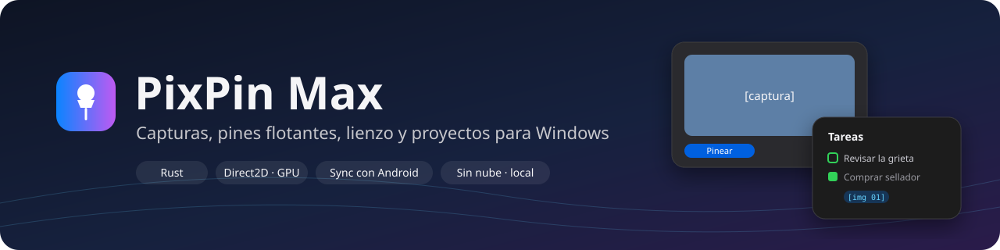
</p>

<p align="center">
  <a href="https://github.com/1xmanMAX/PIXPIN_PRO_WINDOWS/releases"></a>
  
  
  
</p>

<p align="center">
  <b>Captura</b> · <b>Pines flotantes</b> · <b>Chat por proyectos</b> · <b>Lienzo</b> · <b>Timeline</b> · <b>Tareas</b> · <b>Lecciones</b> · <b>Planos y modelos 3D</b> · <b>Sincroniza con Android</b>
</p>

---

**PixPin Max** es una app de escritorio para Windows 10 (21H2) y 11. Sirve para capturar la pantalla, dejar cualquier cosa
flotando **siempre encima** (fotos, vídeos, audios, PDF, listas…), dibujar encima y guardarlo todo
ordenado en **proyectos con forma de chat**. Es el hermano de escritorio de **PixPin Android**: lee
y escribe los mismos proyectos y se sincroniza con el móvil por Wi‑Fi, **sin nube y sin cuentas**.

Está escrita en Rust sobre lo que Windows ya trae (Direct2D, DirectWrite, DirectComposition, Media
Foundation, Windows.Media.Ocr, WebView2). Así arranca al instante y va fluida en equipos modestos:
la máquina de referencia es un Core i3 de 3.ª generación con 4 GB.

> [!NOTE]
> El nombre **PixPin** pertenece a DepthPixel. Este proyecto es una implementación personal e
> independiente, igual que su versión Android.

## ¿Qué puedo hacer con PixPin Max?

Dicho fácil, para cualquier persona:

| | Quiero… | Con PixPin Max… |
|:-:|---|---|
| 📸 | Guardar algo que veo en la pantalla | Pulso `Ctrl Alt X`, elijo la zona y listo: la copio, la dejo flotando o la mando a un proyecto. |
| 📌 | Tener algo siempre a la vista | Lo «pineo»: una foto, un vídeo, un PDF o una lista se queda encima de todas las ventanas. |
| 💬 | Ordenar mis cosas por temas | Cada proyecto es un chat, como en el móvil: notas, fotos, audios y documentos, juntos. |
| ✏️ | Marcar o explicar algo | Dibujo encima con lápiz, flechas, recuadros y texto. |
| 📐 | Ver un plano de AutoCAD sin tener AutoCAD | Abro el `.dwg` y se ve al instante. Mido, marco, anoto e imprimo. |
| 🏠 | Ver un edificio en 3D (Revit o IFC) | Lo giro con el ratón, lo corto con una caja, veo cada planta y lo que mide cada pieza. |
| ⛰️ | Ver un terreno o una carretera | Abro el LandXML o los puntos de Civil 3D y salen con colores por altura y curvas de nivel. |
| 📖 | Leer un PDF o un Word mientras trabajo | Se abre pequeño, como un pin, al lado de lo que hago; o a pantalla completa con `F11`. |
| 📱 | Tenerlo también en el móvil | Se sincroniza con PixPin Android por Wi‑Fi, sin nube y sin cuentas. |

## Índice

- [¿Qué puedo hacer?](#qué-puedo-hacer-con-pixpin-max)
- [Un vistazo](#un-vistazo)
- [Qué hace](#qué-hace)
  - [Capturar](#capturar)
  - [Pines flotantes](#pines-flotantes)
  - [Proyectos y chat](#proyectos-y-chat)
  - [Timeline y lecciones](#timeline-y-lecciones)
  - [Tareas y galería](#tareas-y-galería)
  - [Buscar en todo](#buscar-en-todo)
  - [La bandeja](#la-bandeja)
  - [El lienzo](#el-lienzo)
  - [Abrir fotos, vídeos y audios](#abrir-fotos-vídeos-y-audios)
  - [Planos de AutoCAD](#planos-de-autocad)
  - [Modelos 3D: Revit e IFC](#modelos-3d-revit-e-ifc)
  - [Terrenos y carreteras (Civil 3D)](#terrenos-y-carreteras-civil-3d)
  - [Leer PDF y Word como un pin](#leer-pdf-y-word-como-un-pin)
  - [Compartir y arrastrar](#compartir-y-arrastrar)
  - [Flow Launcher](#flow-launcher)
  - [Sincronizar con el móvil](#sincronizar-con-el-móvil)
  - [Ajustes](#ajustes)
- [Atajos de teclado](#atajos-de-teclado)
- [Instalar](#instalar)
- [Cómo está hecho](#cómo-está-hecho)
- [Compilar y probar](#compilar-y-probar)
- [Privacidad](#privacidad)
- [Licencia](#licencia)

## Un vistazo

| Capturar y anotar sin abrir otra ventana | Buscar en todo PixPin |
|---|---|
| 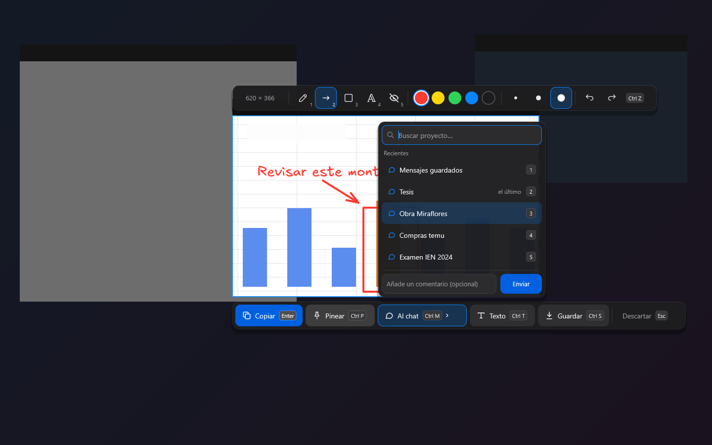 | 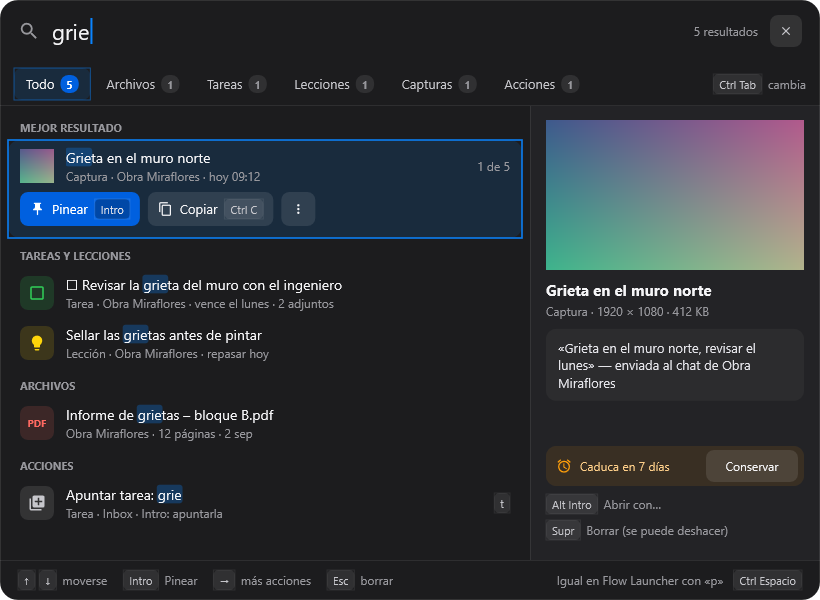 |
| **Timeline: el día, minuto a minuto** | **Cada momento, como una historia** |
| 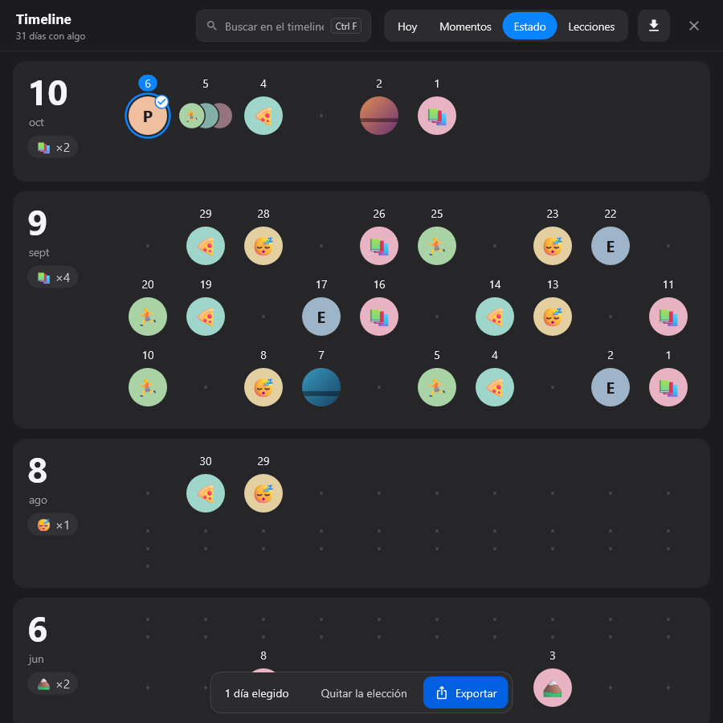 | 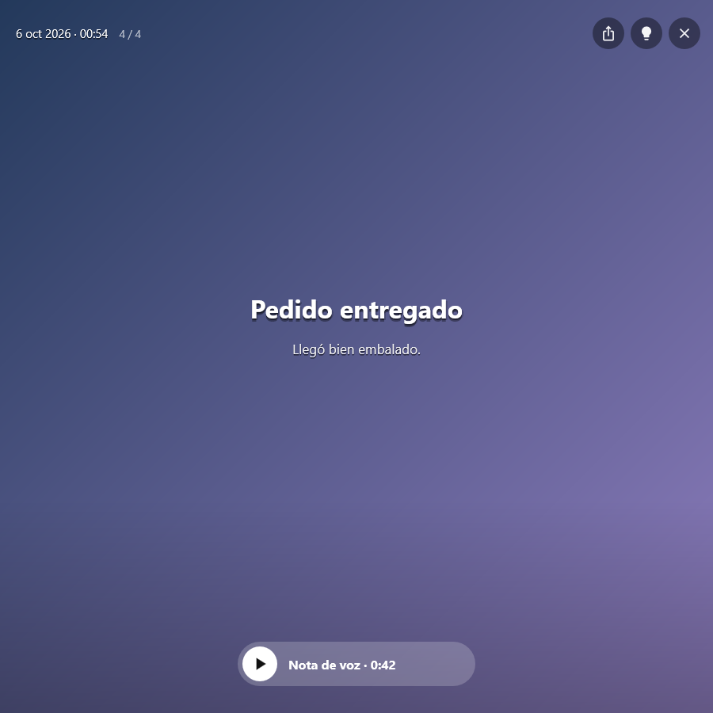 |
| **Lecciones aprendidas, dentro del timeline** | **Galería de capturas que caducan** |
| 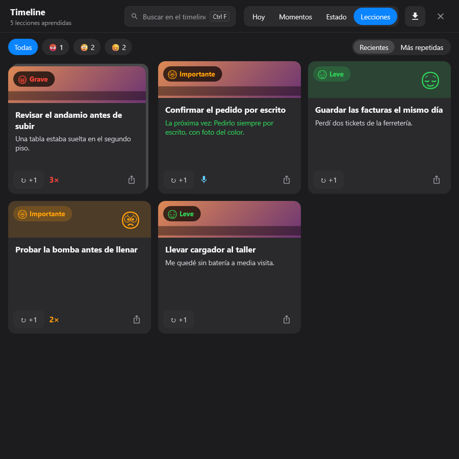 | 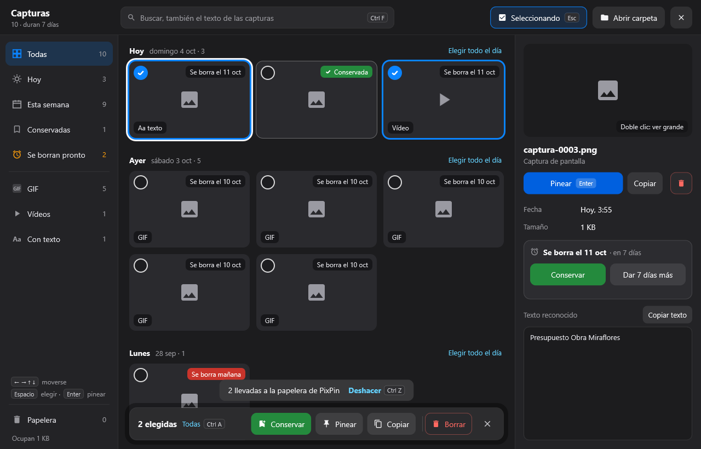 |
| **Planos de AutoCAD, sin AutoCAD** | **Edificios en 3D, cortados por donde quieras** |
| 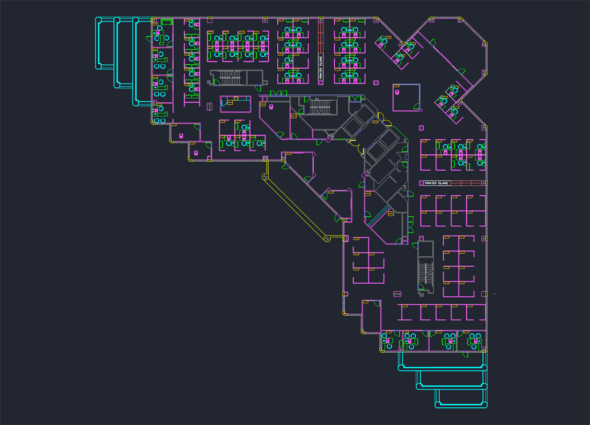 | 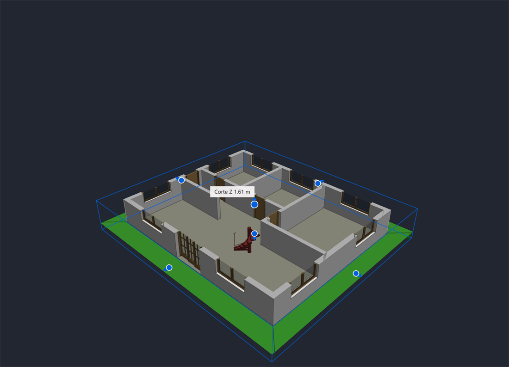 |


```mermaid
flowchart LR
    A([Atajo · bandeja · Flow · Alt+gesto]) --> B[Elegir la zona<br/>Z V P S G L T]
    B --> C{Después de elegir}
    C -->|Copiar · Enter| D[(Portapapeles)]
    C -->|Pinear · Ctrl P| E[Pin flotante<br/>siempre encima]
    C -->|Al chat · Ctrl M| F[Chat del proyecto]
    C -->|Texto · Ctrl T| G[OCR de Windows]
    C -->|Guardar · Ctrl S| H[Galería<br/>caduca en 7 días]
    H -->|Conservar| F
    F <-->|Wi‑Fi, sin nube| I[PixPin Android]
```

## Qué hace

### Capturar

Un atajo (de fábrica **Ctrl Alt X**) o la bandeja abren la captura. Abajo sale una barra con cada
modo y su letra; no hace falta recordar más atajos.

| Elegir la zona | Después de elegir |
|---|---|
| 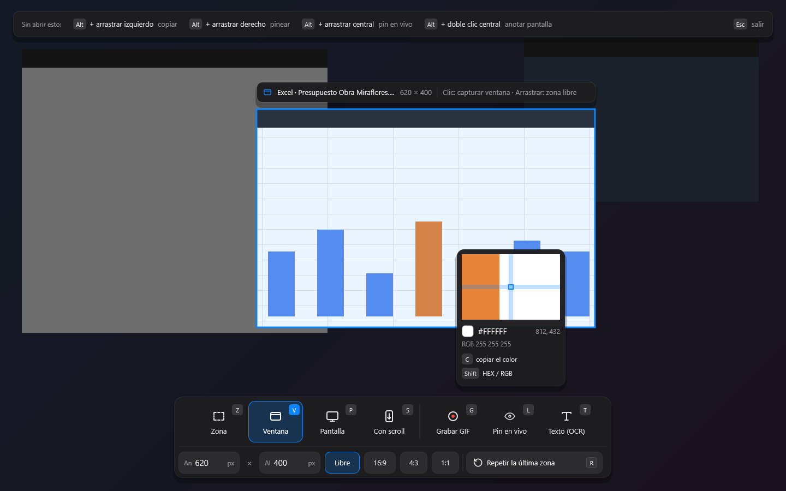 |  |

- **Modos**: Zona `Z`, Ventana `V` (resalta la ventana bajo el ratón con su nombre), Pantalla `P`,
  Con scroll `S`, Grabar GIF `G`, Pin en vivo `L` y Texto con OCR `T`.
- **Medidas exactas** tecleando ancho × alto, proporciones **16:9 · 4:3 · 1:1** y **Repetir la última zona** (`R`).
- **Lupa** con el color en HEX y RGB; `C` lo copia.
- **Después de elegir**: Copiar (azul, `Enter`), Pinear, Al chat (eliges el proyecto en un paso,
  con buscador y teclas 1–6), Texto (OCR) y Guardar.
- **Anotar encima sin abrir otra ventana**: lápiz, flecha, rectángulo, texto y mosaico (teclas
  `1`–`5`), con colores, grosores y deshacer. Lo dibujado entra en la imagen.
- **Gestos con Alt** en cualquier sitio: arrastrar con el izquierdo copia, con el derecho pinea, con
  el central saca un pin en vivo y el doble clic central abre el anotador de pantalla.

### Pines flotantes

Todo lo que se pinea queda **siempre encima**: fotos, vídeos, PDF, notas, listas de tareas,
herramientas (contador, ruleta, gastos…) y **pines en vivo** que copian una zona de la pantalla
en tiempo real.

El pin en vivo marca su zona con un recuadro azul (que no sale en ninguna captura), enseña el
ratón cuando pasa por ella y se puede **manejar a distancia**: con el botón del ratón de su barra,
los clics, los arrastres y la rueda sobre el pin actúan en la zona. Se pausa y se reanuda con
▶/⏸ (o doble clic), y la rueda lo agranda como a cualquier pin.

<table>
  <tr>
    <td width="58%" valign="top">
      <b>Barra común al pasar el ratón</b><br><br>
      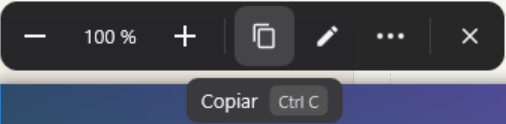<br><br>
      Con su chapita de atajo en cada botón («Copiar Ctrl C»). En un vídeo, el control propio es
      reproducir, la línea de tiempo y el volumen; en un PDF, la página; en un pin en vivo, congelar.
    </td>
    <td width="42%" valign="top">
      <b>Panel «Pines abiertos»</b><br><br>
      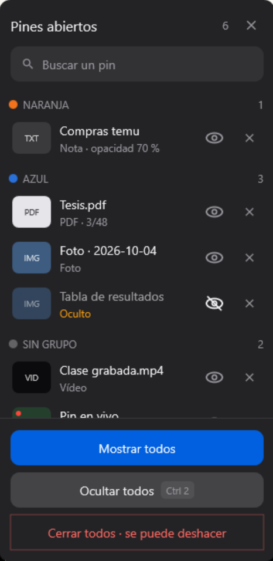
    </td>
  </tr>
</table>

- **La misma barra en todos**: primero su control propio (zoom, página del PDF, reproducir…),
  después Copiar, Anotar y Más; Cerrar aparte.
- **Vídeo con aceleración de la GPU** (Media Foundation sobre Direct3D 11) a la frecuencia del
  monitor, con línea de tiempo, volumen y sonido al abrirlo.
- **Opacidad** del 20 al 100 % (Mayús + rueda), **guías azules** para alinear pines y un imán
  suave al soltar.
- **Pines abiertos**: lista agrupada por color para encontrar los ocultos, mostrar u ocultar
  todos (`Ctrl 2`) y cerrar todos con deshacer.

| Lista de tareas | Gastos |
|---|---|
| 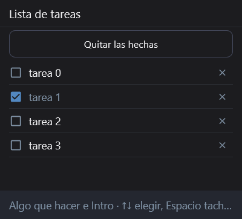 | 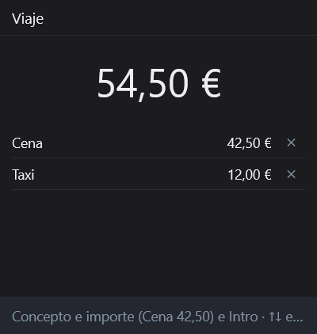 |

### Proyectos y chat

Cada proyecto es un chat, como en el móvil: notas, fotos con su descripción, notas de voz,
documentos, PDF, tablas y lienzos. La tarjeta del proyecto enseña la portada y las hojas en
miniatura.

<table>
  <tr>
    <td width="50%" valign="top" rowspan="2">
      <b>Menú de un mensaje</b><br><br>
      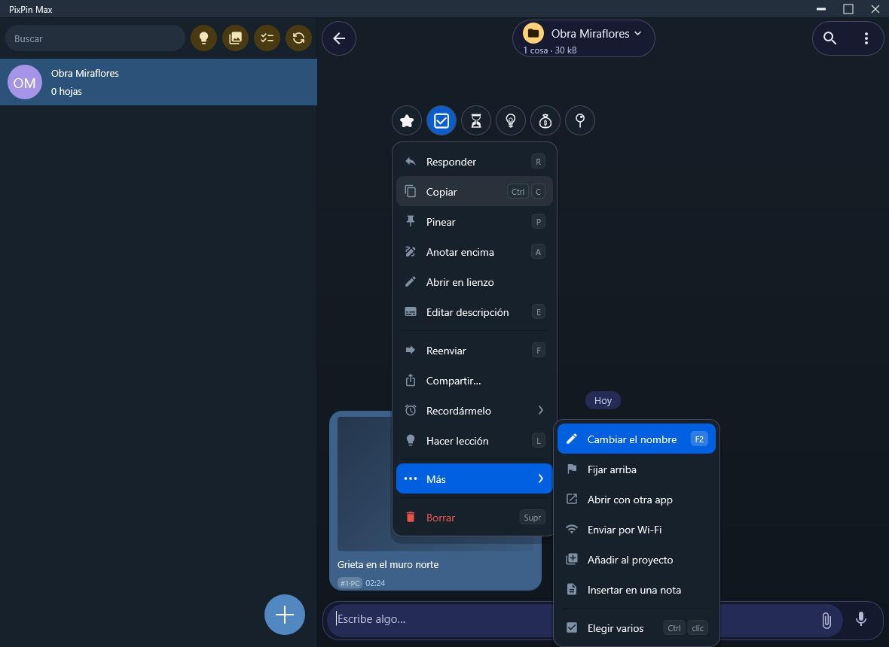
    </td>
    <td width="50%" valign="top">
      <b>Botón de adjuntar</b><br><br>
      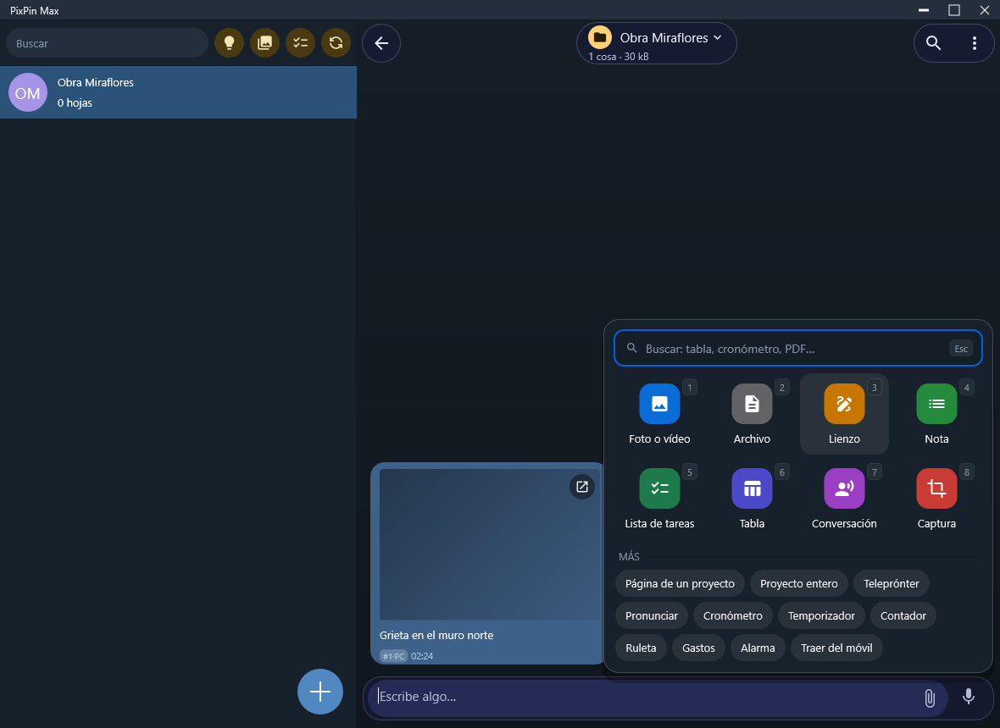
    </td>
  </tr>
  <tr>
    <td valign="top">
      <b>Enviar varias fotos con descripción</b><br><br>
      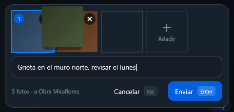
    </td>
  </tr>
</table>

- **Menú de cada mensaje** con iconos y letras: Responder `R`, Copiar, Pinear `P`, Anotar `A`,
  Editar descripción `E`, Reenviar `F`, Hacer lección `L`… Lo menos usado va en «Más». Encima,
  las etiquetas ⭐ ✅ ⏳ 💡 💰 📍.
- **Adjuntar** como cuadrícula con buscador y teclas `1`–`8`: foto o vídeo, archivo, lienzo,
  nota, lista de tareas, tabla, conversación y captura. Debajo, lo menos usado: teleprónter,
  pronunciar, cronómetro, ruleta, gastos, traer del móvil…
- **Varias fotos con descripción**: se reordenan arrastrando y se quitan con ✕. El texto
  queda como descripción de la foto y se puede editar después.
- **Cambiar el nombre** de cualquier archivo o audio (`F2`).
- **PDF**: entra como un solo mensaje. Sus páginas son hojas del proyecto que se anotan como
  lienzos, con lectura seguida, marcadores, búsqueda y fusión. `pixpin-aligerar.exe` lo comprime
  en segundo plano.
- **Documentos**: Word, EPUB, HTML, Markdown y texto se leen dentro, con zoom, marcadores y
  tinta. PowerPoint se presenta a pantalla completa y Excel entra como tablas que calculan.
- **Voz**: notas de voz, transcripción con Whisper (sobre el ONNX Runtime de Windows),
  teleprónter, pronunciar y conversación por turnos.

| Proyectos, tema claro | Tema oscuro | Ventana estrecha |
|---|---|---|
| 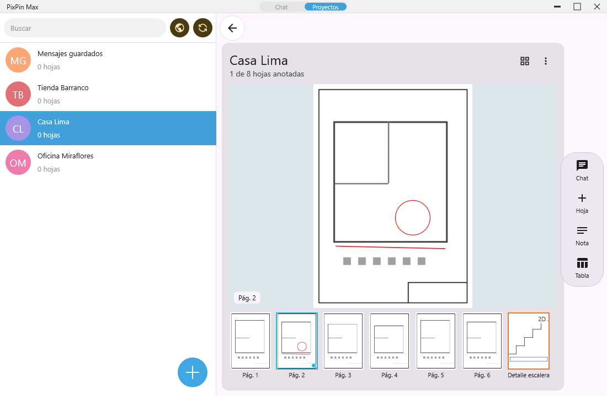 | 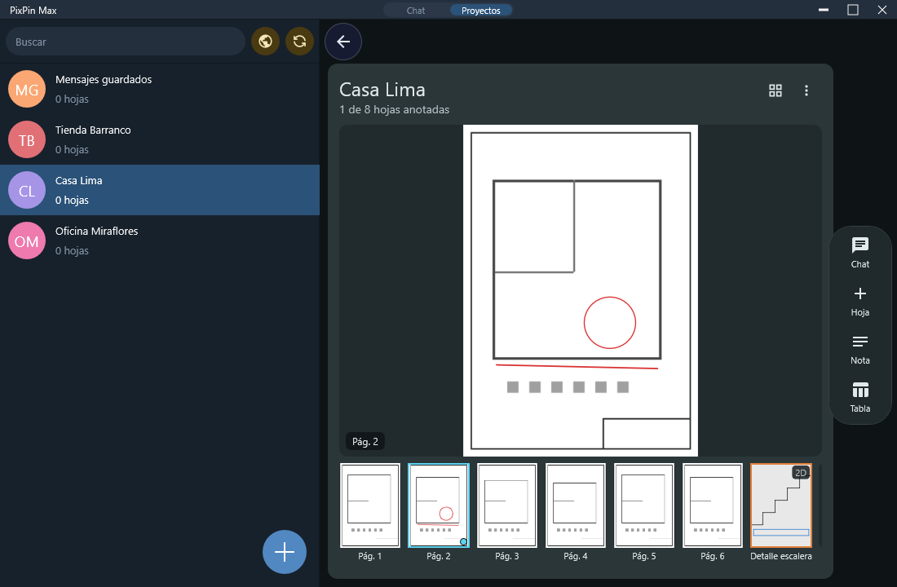 | 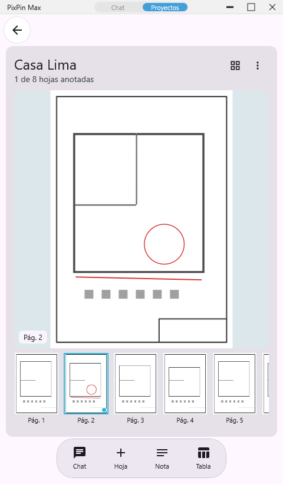 |

### Timeline y lecciones

Las cuatro ventanas de abajo comparten la misma barra: título, buscador (`Ctrl F`) y, a la derecha,
solo los botones propios de cada una.

**Timeline**: apuntar lo que pasa **en el momento**, minuto a minuto, con la voz, escribiendo o con
una foto. Es tan rápido como un chat, pero se ve como una línea de tiempo. Al dictar, «con esto
pasó…» abre el **título** y «y así te lo cuento…» la **descripción** (da igual cómo lo escriba el
reconocimiento de voz). Se guarda también el audio, con la hora en que empezaste a hablar.

| Hoy: las últimas 24 horas | Momentos: el archivo, día a día |
|---|---|
| 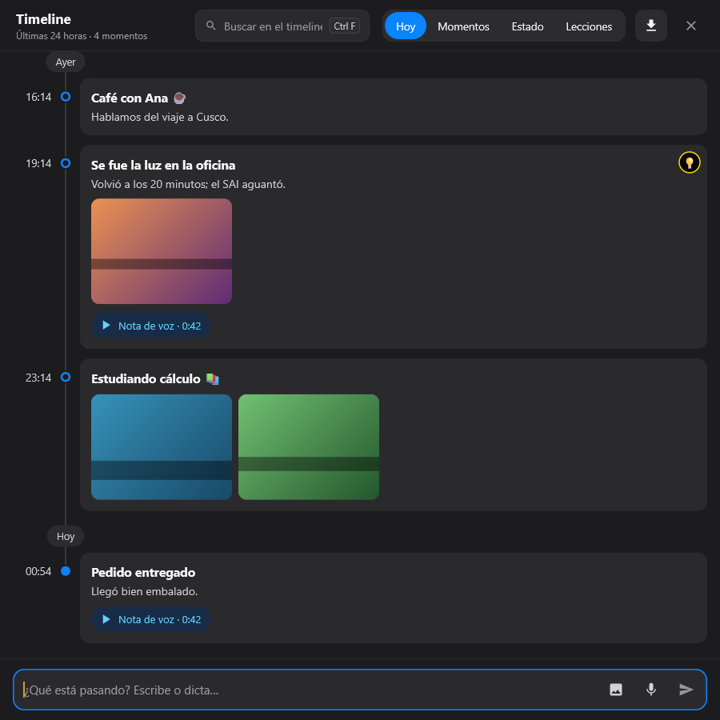 | 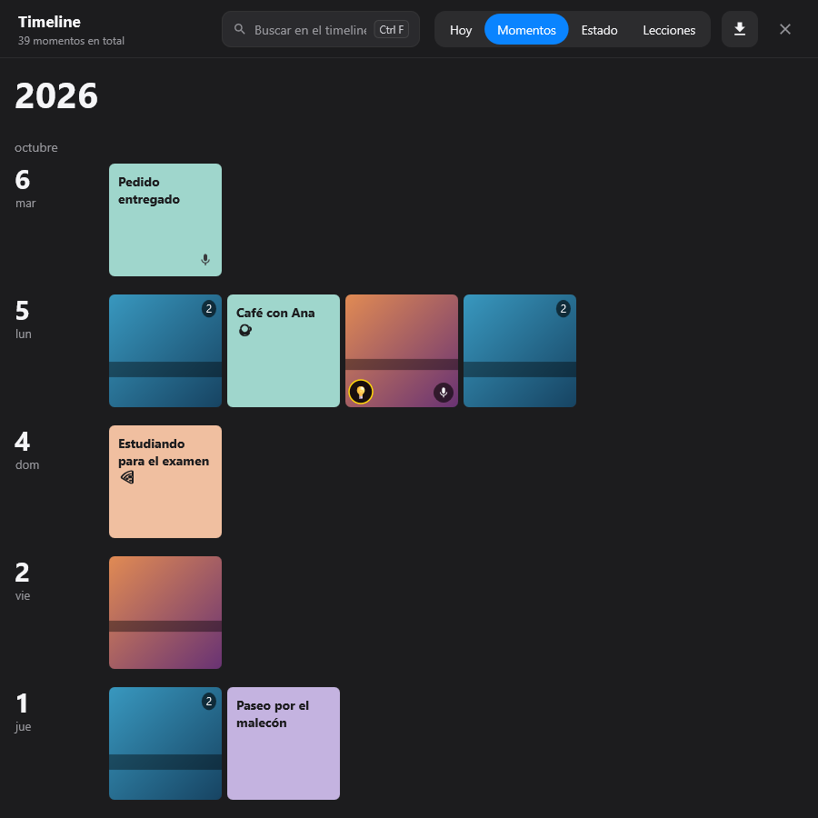 |
| **Estado: cada mes, sus días y sus emoticonos** | **Cada momento, como una historia** |
|  | 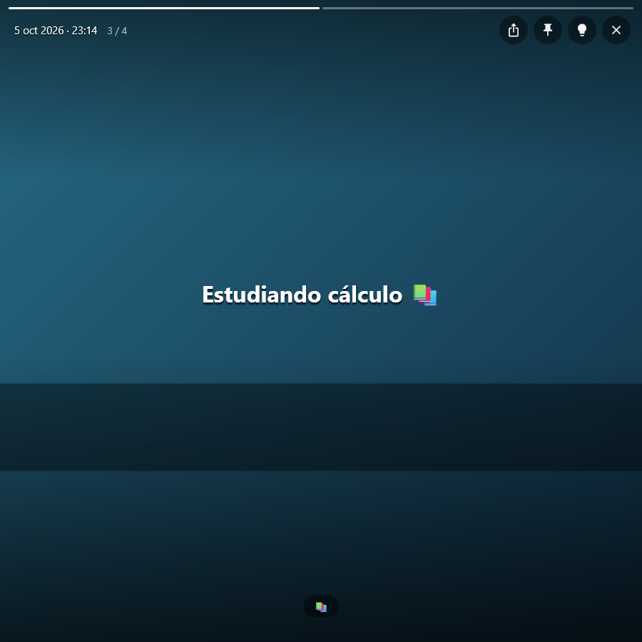 |

- **Hoy**, **Momentos** y **Estado** son los mismos momentos vistos de tres formas. En Estado, cada
  día lleva los emoticonos que usaste, apilados, y cada mes dice el que más se repitió.
- Al pulsar un momento se abre como una **historia**: la foto de fondo y el texto en el medio
  (o un degradado si no tiene foto), barritas si tiene varias fotos, y la nota de voz.
- **Compartir como imagen**: cada momento sale como una tarjeta de 1080×1350, lista para mandar.
- **Exportar** a HTML o PDF lo que estás viendo, o los días que elijas. El HTML lleva dentro las
  fotos **y los audios** y se ve igual que la app: línea de tiempo y, al pulsar, la historia.
- Lo anterior a 24 horas no se borra: está en Momentos y en Estado, y el buscador lo encuentra.

| Tarjeta para compartir | Página exportada, con la historia abierta |
|---|---|
| 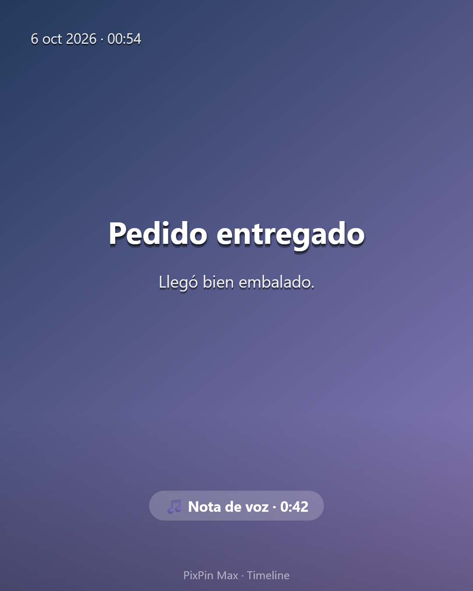 | 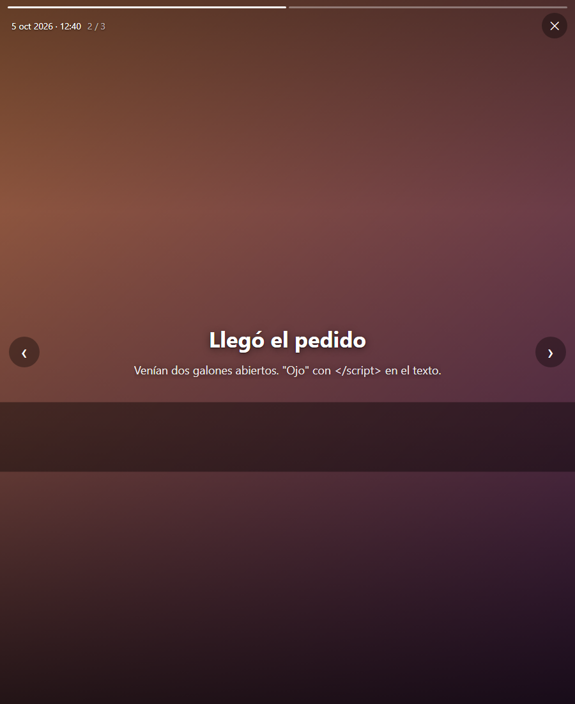 |

**Lecciones aprendidas**: viven en el mismo sitio, como una pestaña más del timeline. La bombilla
de cualquier momento lo convierte en lección.


- Tarjetas con la **gravedad en emoticono y color**: 😌 leve, 😟 importante, 😡 grave.
- **«Me volvió a pasar»** suma una vez más; se filtra por gravedad o por las más repetidas.
- Siguen siendo las lecciones de siempre: el mismo formato que Android, se sincronizan y entran en
  el **repaso espaciado** (`1` lo recordaba, `2` a medias, `3` lo olvidé).

### Tareas y galería

**Tareas**: todas las listas de todos los proyectos en una sola ventana, en **lista** o en
**tarjetas**. Lo que se apunta rápido entra en el **Inbox**, y «Mover a…» lo lleva a la lista que
toque. Una tarea puede llevar imágenes (`Ctrl V`): en la vista de tarjetas la foto es el fondo y,
si hay varias, se ven apiladas. Los **emoticonos** de una tarea salen como estados de colores.

| Tarjetas | Lista |
|---|---|
| 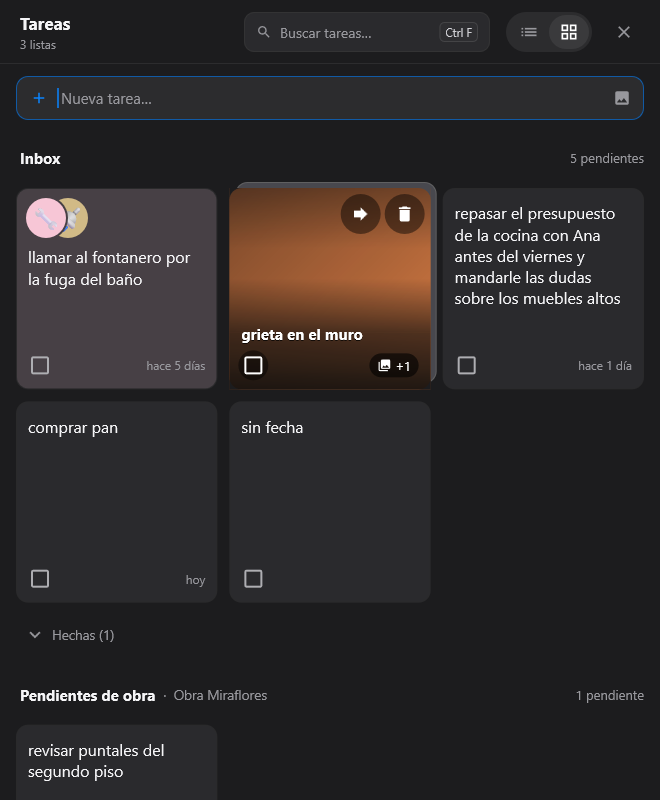 | 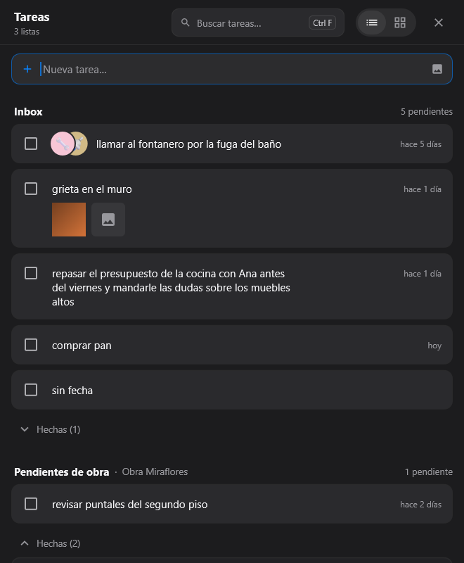 |

**Galería de capturas**: las capturas hechas en el PC **se borran solas a los 7 días** (van a la
papelera de PixPin y se pueden recuperar), salvo las que conservas.

| Al pasar el ratón | Elegir varias |
|---|---|
|  | 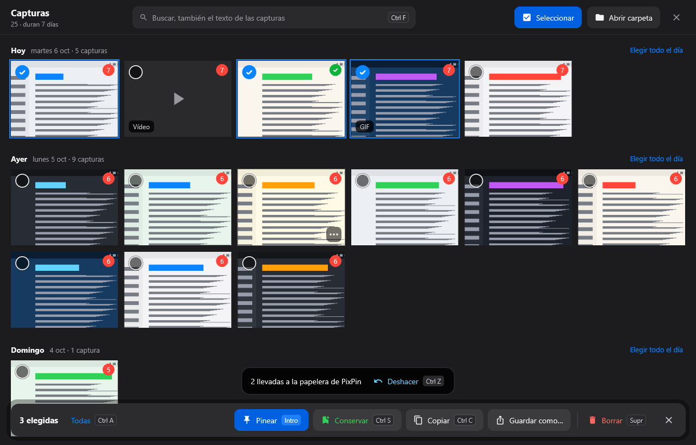 |

- Cada captura dice en rojo los **días que le quedan**.
- **Clic derecho** (o el botón «⋯»): pinear, copiar, guardar como, mostrar en la carpeta,
  conservar, dar 7 días más y borrar.
- **Busca también el texto que hay dentro de las capturas** (OCR en segundo plano, con caché).
- Borrar no pregunta: se deshace con **Deshacer** (`Ctrl Z`).

### Buscar en todo

Una ventana para encontrar cualquier cosa: archivos de los chats, tareas, lecciones, capturas y
acciones, con pestañas, vista previa y todo hacible con teclado. Usa el mismo buscador que el
plugin de Flow Launcher, así que da los mismos resultados.

| Antes de escribir | Con resultados |
|---|---|
| 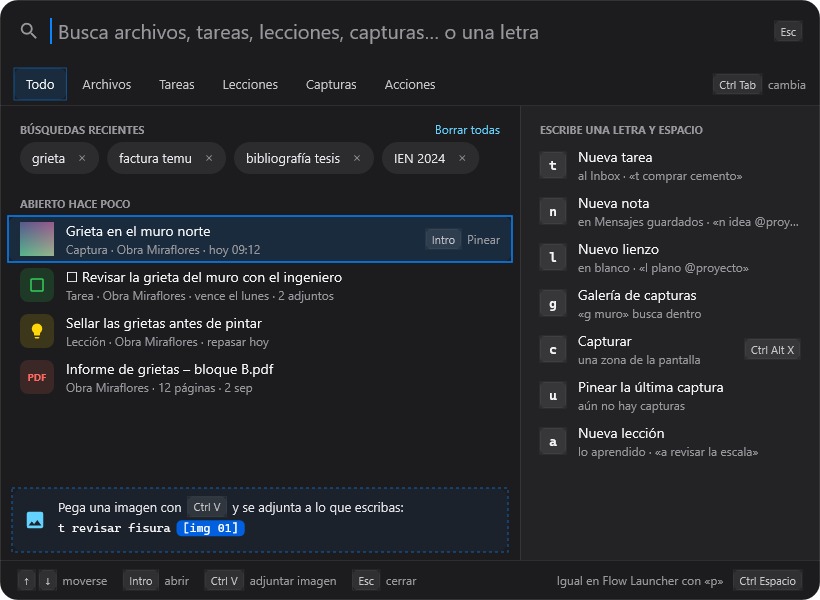 |  |

Las letras rápidas sirven aquí y en Flow: `t` tarea, `n` nota, `l` lienzo, `g` galería,
`c` capturar, `u` última captura, `a` nueva lección.

### La bandeja

Clic izquierdo en el icono de la bandeja: un centro de control con un buscador de acciones,
**Capturar** con sus modos, favoritos que eliges tú, interruptores para los pines y los atajos, las
últimas capturas y acceso a Tareas, Lecciones y la galería. El clic derecho sigue abriendo el menú
clásico.

| Tema oscuro | Tema claro |
|---|---|
| 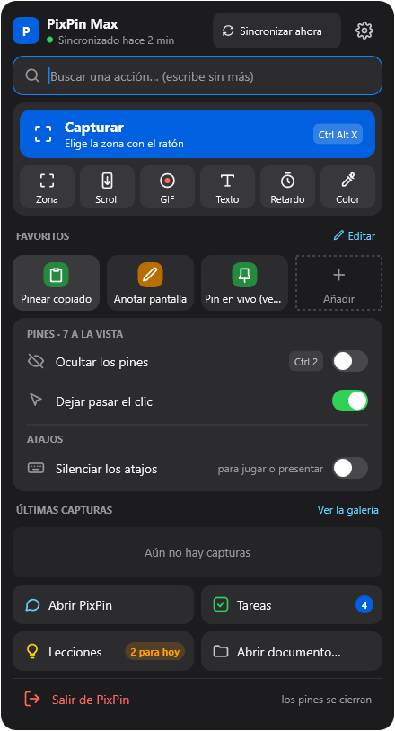 | 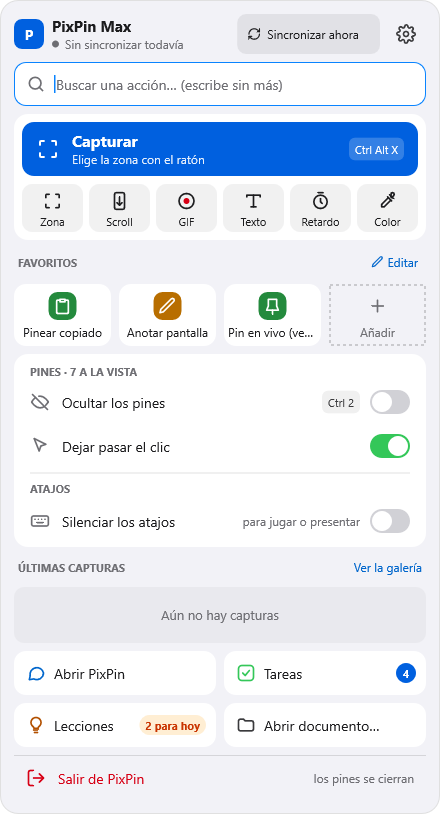 |

### El lienzo

Un puerto de Excalidraw con las herramientas del móvil. La barra va agrupada en una fila: cada
grupo enseña su última herramienta y despliega las demás.

| Barra agrupada | Soldar vértices | Pasos y foco |
|---|---|---|
| 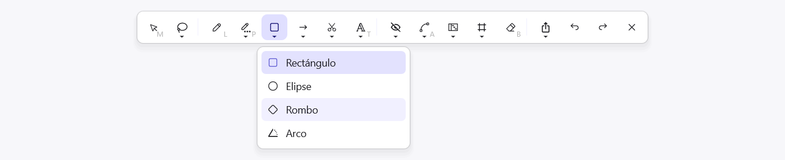 | 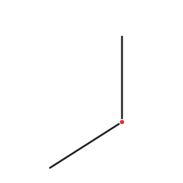 | 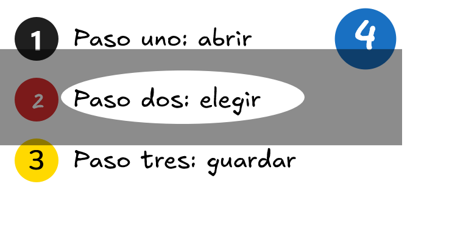 |

- **Texto sin caja** con ocho letras incluidas (Excalifont, Nunito, Lilita One, Comic Shanns,
  Work Sans, Fraunces, Courier New y Caveat).
- **Tinta**: lápiz, grafito, resaltador, goma y bote de relleno exacto entre figuras.
- **Construir**: recortar y extender, soldar vértices, puntos con letra, cotas, escala gráfica y calibrar.
- **Señalar y tapar**: pasos numerados, foco, lupa, pixelar o desenfocar, láser y marcadores.
- **Gráficas, tablas y cronogramas**; tablas pegadas de Excel o Sheets con celdas combinadas.
- **Zona al chat**: un rectángulo del lienzo va al chat con su vínculo de vuelta.
- **Imprimir y exportar** a PNG, JPG, SVG, PDF y una página web que se puede volver a anotar.

| Gráfica | Tabla | Pixelar | Lupa |
|---|---|---|---|
| 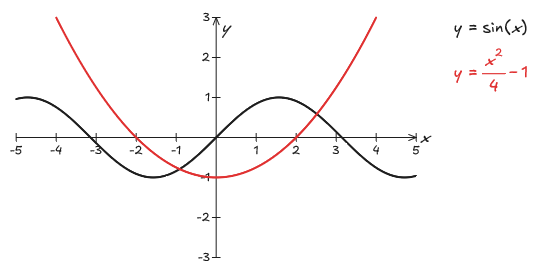 | 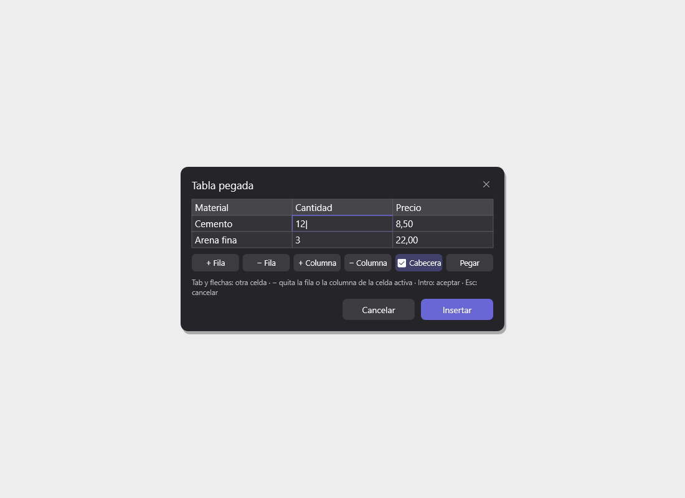 | 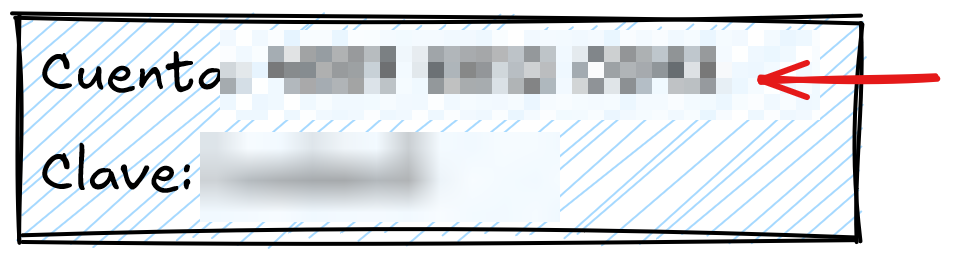 | 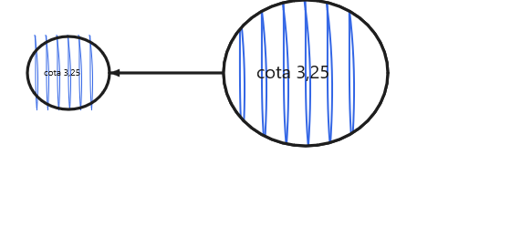 |

### Abrir fotos, vídeos y audios

PixPin puede ser la **app predeterminada** (el instalador abre la página de Windows para elegirla).
Al abrir un archivo sale como ventana flotante, en unos 200 ms:

| Tipo | Formatos | Se abre como |
|---|---|---|
| Fotos | png, jpg, jfif, webp, bmp, gif, tiff, ico, jxr, heic\*, avif\*, jxl\*, RAW | Pin de imagen |
| Vídeos | mp4, mkv, mov, m4v, avi, wmv, mpg, ts, webm\* | Pin de vídeo con la GPU |
| Audios | mp3, m4a, wav, aac, flac, ogg, opus, wma, 3gp, amr | Reproductor flotante, en cola si son varios |
| Documentos | pdf, docx, epub, pptx, md | Su lector, como un pin |
| Planos | dwg, dxf | El visor de planos |
| Modelos 3D | ifc, rvt (Revit 2023–2025) | El visor 3D |
| Civil 3D | xml (LandXML), csv y txt de puntos | El visor 3D, como terreno |

\* Necesitan la extensión gratuita de Microsoft Store (HEVC, AV1, VP9 o JPEG XL). Si falta, PixPin
dice cuál instalar.

### Planos de AutoCAD

Abre un **DWG o DXF** con doble clic, desde el chat o arrastrándolo, y se ve al momento: **sin
AutoCAD** y sin esperar. Sale como un pin, encima de todo, y se mueve y se estira como cualquier
ventana.


**Moverse por el plano**: la rueda acerca y aleja hacia donde apunta el ratón; arrastrar mueve el
plano; doble clic (o `F`) lo enseña entero. Al pasar el ratón sale una barra arriba, fuera del
plano, con estas herramientas:

| Herramienta | Tecla | Para qué sirve |
|---|:-:|---|
| 📏 Medir | `M` | Mide distancias. La regla se engancha sola a las esquinas, a los centros, a cualquier punto de una línea y a la perpendicular (con su ⊥ y «90°»). |
| 🖨️ Marcos | `I` | Arrastra para marcar las partes que quieres imprimir. `Ctrl P` saca cada marco en su hoja, con marco y membrete o sin él. |
| ✏️ Anotar | `A` | Dibuja y escribe encima del plano con las mismas herramientas del lienzo. Lo anotado se guarda y sale al imprimir. |
| 🧊 3D | `3` | Abre el mismo plano en 3D, si tiene volúmenes. |
| 🌗 Tema | `B` | Fondo oscuro o claro. |
| 📌 Encima | `T` | Deja el plano siempre encima, o no. |

| Anotar encima del plano | Marcar lo que se imprime |
|---|---|
| 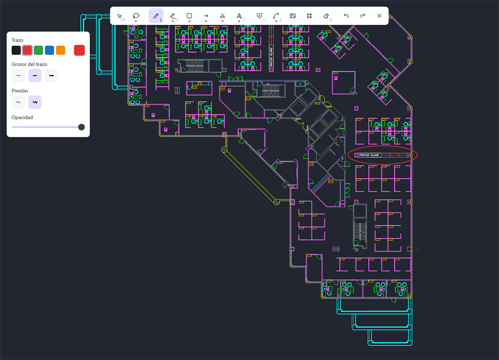 | 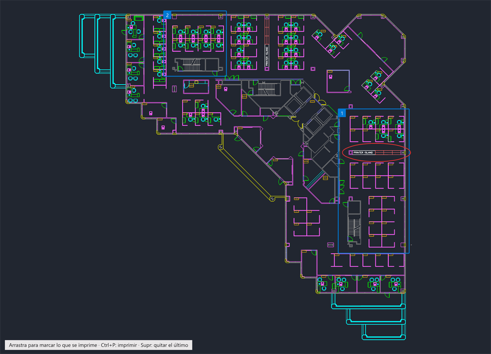 |

- Los textos con **letras de AutoCAD (SHX)** se ven aunque no tengas AutoCAD instalado, con ñ,
  tildes, ° y Ø. El texto al revés o cabeza abajo sale como en AutoCAD.
- El grosor de la tinta se adapta al zoom: un trazo «fino» se ve fino en el plano, no gigante.

### Modelos 3D: Revit e IFC

Abre un modelo de **Revit** (`.rvt`) o **IFC** (`.ifc`) y se ve en 3D en una ventana como un pin.
No hace falta tener Revit.

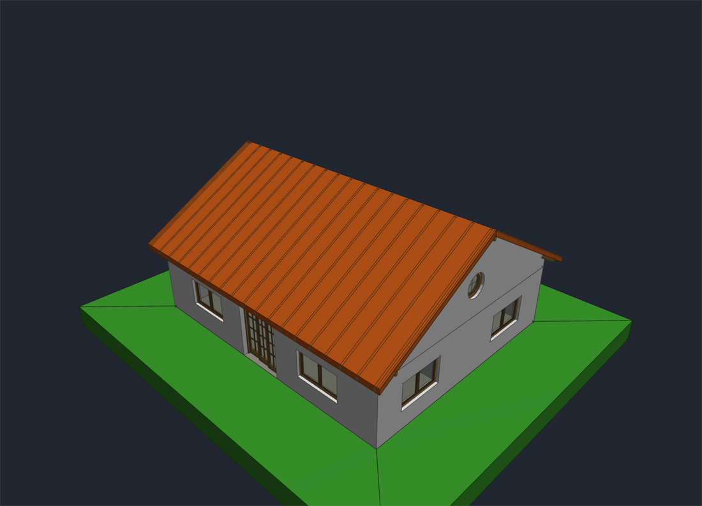

**Cómo se usa**, con el ratón:

- **Girar**: arrastra con el botón izquierdo. Gira alrededor de lo que tocas; un punto naranja te
  enseña dónde.
- **Mover**: arrastra con el botón derecho (o `Mayús` + izquierdo).
- **Acercar**: la rueda, hacia donde apunta el ratón.
- **¿Qué es esto?**: un clic en una pieza. Abajo sale qué es, en qué planta está, su **volumen** y su
  **área**.
- **Aislar**: otro clic en la misma pieza y se queda sola, encuadrada. `Esc` vuelve a todo.

| ✂️ Caja de sección (`C`) | 🗂️ Niveles y categorías (`L`) |
|---|---|
|  | 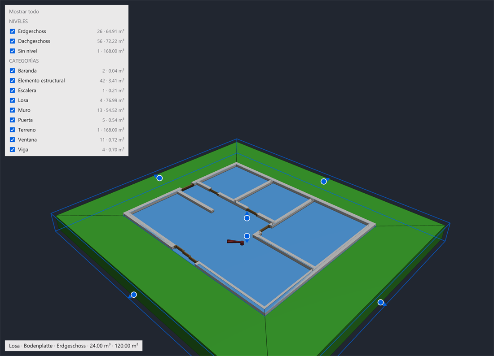 |
| Como la «Section Box» de Revit: el modelo queda dentro de una caja con **un tirador en cada cara**. Arrastra un tirador y esa cara corta el modelo. Lo cortado se ve **macizo**, no hueco. | Un panel con las **plantas** del edificio y las **categorías** (muros, losas, vigas…), con cuántas piezas hay y su volumen. Un clic oculta o muestra; `Ctrl` + clic deja solo esa. |

| 🔍 Una pieza aislada, con lo que mide | 🏗️ Un modelo de Revit |
|---|---|
| 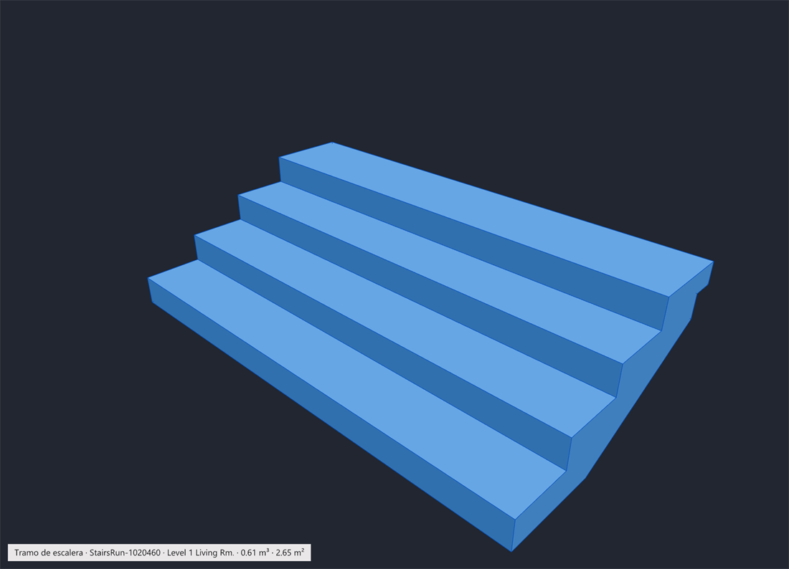 | 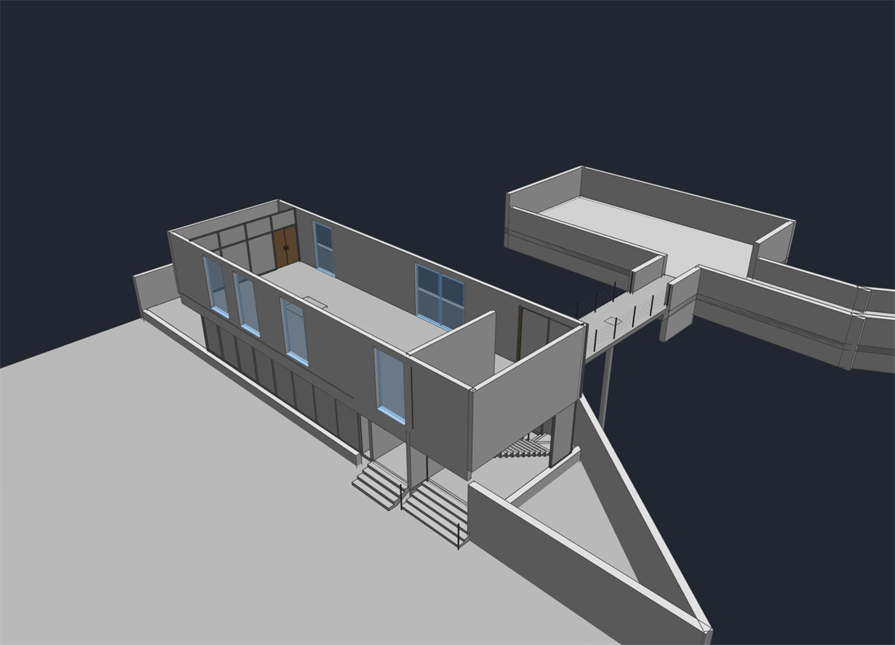 |

- Más teclas: `F` ver todo · `P` vista en planta · `B` fondo claro u oscuro · `A` aristas ·
  `T` siempre encima · flechas para girar · `+` `−` para acercar.
- **IFC**: se lee con [ifc-lite](https://github.com/LTplus-AG/ifc-lite). Salen las plantas
  (`IfcBuildingStorey`) con sus nombres y cotas.
- **Revit**: se lee con [rvt-rs](https://github.com/DrunkOnJava/rvt-rs), que entiende los
  proyectos de **Revit 2023 a 2025** sin Revit. Lo que esa librería aún no sabe dibujar sale como
  una caja; los Revit 2022 y anteriores todavía no se pueden abrir.
- El volumen es exacto cuando la pieza es un sólido cerrado; si no, sale con «≈».

### Terrenos y carreteras (Civil 3D)

Lo de **Civil 3D** también se ve en 3D: superficies con **colores por altura** y **curvas de
nivel**, ejes de carretera con su perfil, puntos, tuberías y parcelas.

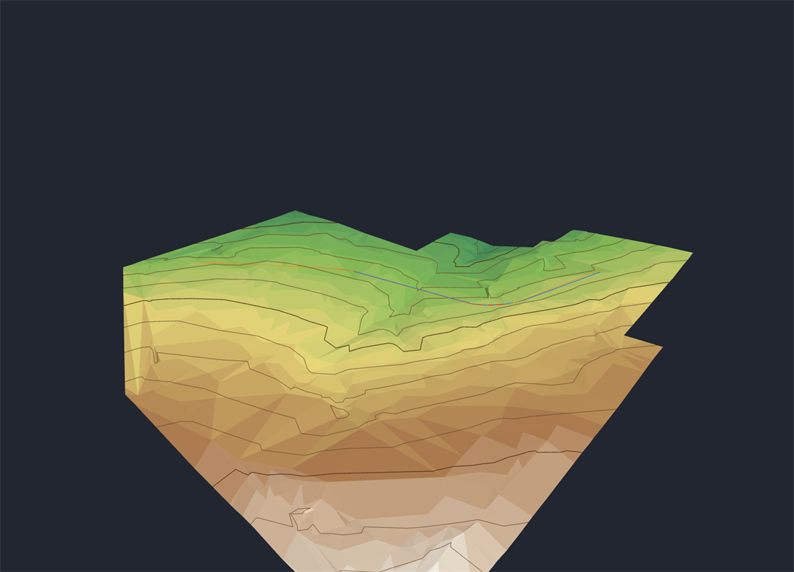

- **LandXML** (`.xml`): superficies, alineamientos y perfiles, puntos, redes de tuberías y parcelas.
- **Ficheros de puntos** (`.csv` y `.txt`, en orden PNEZD o ENZ): se unen solos en un terreno.
- **DWG de Civil 3D**: con el botón `3D` del visor de planos. Si el dibujo se guardó sin sus
  gráficos (`PROXYGRAPHICS = 0`), PixPin avisa, porque esa información no viene en el archivo.

### Leer PDF y Word como un pin

Los **PDF, Word y EPUB** se abren **pequeños, como un pin**, para leer al lado de lo que estás
haciendo. Arriba, fuera de la hoja, sale su barra:

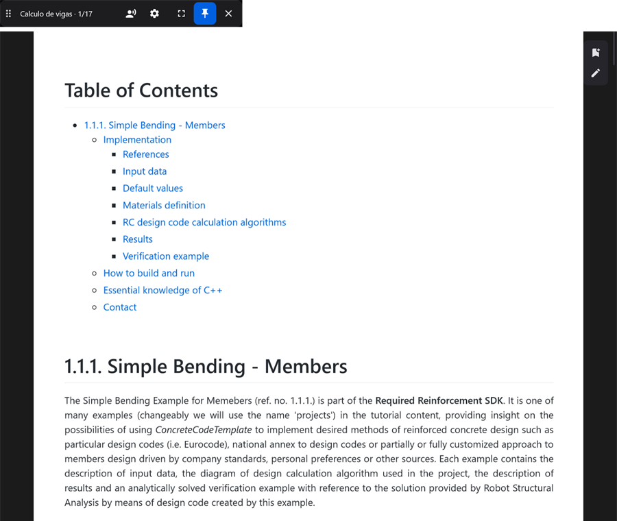

| En la barra | Para qué sirve |
|---|---|
| ⠿ Asa | Mueve la ventana. |
| Nombre · página | El nombre del documento y en qué página vas. Un clic lo cambia. |
| 📑 Índice | Salta a un capítulo (en Word y EPUB). |
| 🗣️ Escuchar | Te lo lee en voz alta. |
| ⚙️ Ajustes | Las opciones del lector. |
| ⛶ Pantalla completa | O `F11`. `Esc` vuelve a pin. |
| 📌 Pin | Siempre encima, o no. |

- Se estira por los bordes como cualquier pin.
- Se puede anotar encima, con marcadores y búsqueda.

### Compartir y arrastrar

Al exportar o compartir algo (el timeline, un lienzo, un PDF anotado, capturas de la galería…)
aparece una **ventanita encima de todo** con cada archivo como una tarjeta: se **arrastra con el
ratón** a WhatsApp, al correo, a una carpeta o a cualquier app, o se comparte, copia, abre o
pinea desde ahí.

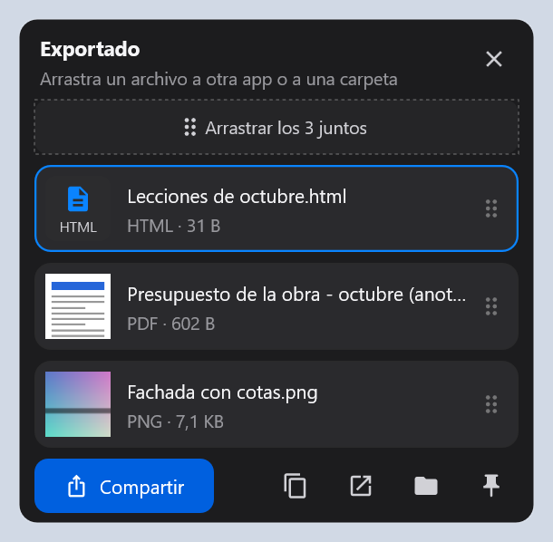

- Una foto **con anotaciones** sale siempre **fusionada**: al arrastrar o copiar un pin dibujado,
  al arrastrar una foto anotada del chat (también si se dibujó en el móvil) y al compartirla.
- Un pin se arrastra a otra app con `Ctrl` + arrastrar.

### Flow Launcher

Con [Flow Launcher](https://www.flowlauncher.com/) se usa PixPin sin abrirla: escribe **`p`**.
El plugin tiene su propio repositorio:
[PIXPIN_PRO_PLUGIN_FLOWLAUNCHER](https://github.com/1xmanMAX/PIXPIN_PRO_PLUGIN_FLOWLAUNCHER).

```
p t comprar sellador [img 01]   → tarea al Inbox, con la imagen pegada (Ctrl V)
p n idea para la tesis          → nota nueva
p g muro                        → buscar en la galería (también por el texto de dentro)
p a revisar la escala           → lección nueva
p lecciones grietas             → buscar lecciones
p s                             → sincronizar con un móvil o con todos (con su estado)
p s [img 01] [archivo 02]       → enviar fotos y archivos a lo que tenga abierto el móvil elegido
p c                             → capturar una zona
```

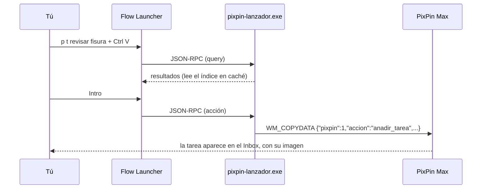
```mermaid
sequenceDiagram
    participant U as Tú
    participant F as Flow Launcher
    participant L as pixpin-lanzador.exe
    participant P as PixPin Max
    U->>F: p t revisar fisura + Ctrl V
    F->>L: JSON-RPC (query)
    L-->>F: resultados (lee el índice en caché)
    U->>F: Intro
    F->>L: JSON-RPC (acción)
    L->>P: WM_COPYDATA {"pixpin":1,"accion":"anadir_tarea",...}
    P-->>U: la tarea aparece en el Inbox, con su imagen
```

El protocolo está documentado en [`docs/protocolo-pedidos.md`](docs/protocolo-pedidos.md):
cualquier programa puede pedirle cosas a PixPin.

### Sincronizar con el móvil

Por Wi‑Fi, sin nube. Los equipos se encuentran por mDNS y juntan los cambios uno a uno. También
puede mandar uno («Lo mío manda»). Antes de borrar se pregunta y antes de recibir se hace copia de
seguridad.

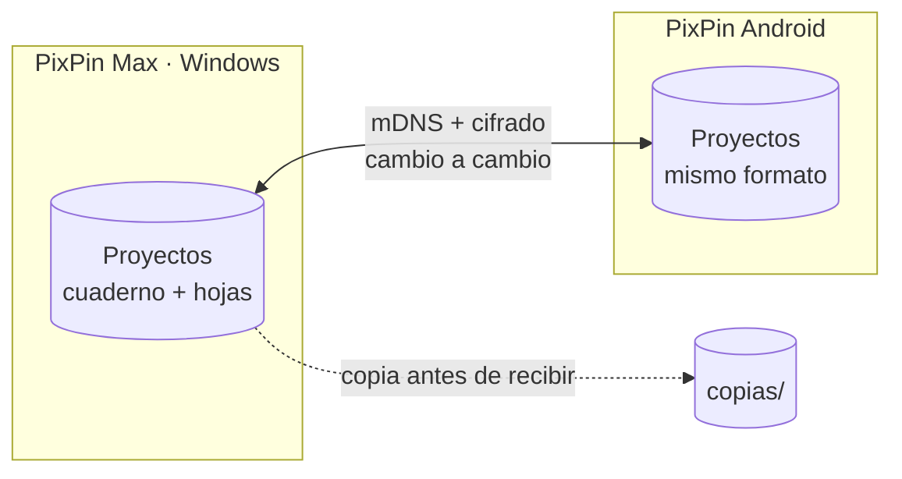
```mermaid
flowchart LR
    subgraph PC[PixPin Max · Windows]
      A[(Proyectos<br/>cuaderno + hojas)]
    end
    subgraph Movil[PixPin Android]
      B[(Proyectos<br/>mismo formato)]
    end
    A <-->|mDNS + cifrado<br/>cambio a cambio| B
    A -.->|copia antes de recibir| C[(copias/)]
```

- Lo anotado sobre PDF, Word y EPUB viaja en las dos direcciones: tinta, marcadores y espacios
  para anotar. Hace falta PixPin Android 0.96 o superior.
- Un lienzo enviado desde el PC se abre en el lienzo del móvil y al revés.
- **Desde Flow (`p s`)**: sale cada móvil del grupo con su estado (🟢 conectado / ⚪ sin conexión) y
  «Todos». Elegir uno sincroniza solo con ese, sin abrir la ventana; al acabar lo dice el globo.
- **Archivos directos a lo que tenga abierto**: en `p s` pegas fotos o archivos de cualquier tipo
  (Ctrl+V), eliges el aparato y entran en el **chat** que tenga abierto; un **lienzo** abierto solo
  acepta fotos (lo demás se niega y el globo lo dice); sin nada abierto, a la conversación general.
  Un PC del grupo los recibe igual. En el móvil, el chat abierto necesita la versión de Android de
  la [guía del 7-oct](docs/investigacion/2026-10-07-archivos-al-chat-abierto-android.md); hasta
  entonces, las fotos van a su lienzo abierto y lo demás a su conversación general.
- Las lecciones se juntan campo a campo.

### Ajustes

Todo lo que antes solo estaba en el archivo de ajustes tiene ahora su control, con un buscador,
una explicación en cada opción y un **punto azul** en lo que has cambiado. Cada opción o sección
se puede restablecer.

En el lienzo se elige **qué herramientas se ven y dónde**: en todos los sitios a la vez o solo en la
pantalla, los pines, el lienzo o el lector, para que cada barra lleve solo lo que se usa ahí.

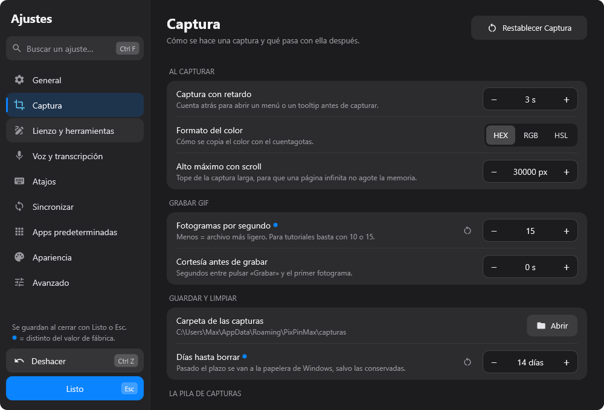

## Atajos de teclado

Solo hay **un atajo general** (capturar, de fábrica `Ctrl Alt X`) y los gestos con Alt. El resto
son letras que **solo valen dentro de la ventana abierta**, y cada botón muestra la suya.

| Dónde | Teclas |
|---|---|
| En todo Windows | `Ctrl Alt X` capturar · `Alt`+arrastrar: izquierdo copia, derecho pinea, central pin en vivo · `Alt`+doble clic central: anotar pantalla · `Ctrl 2` ocultar los pines |
| Al capturar | `Z` `V` `P` `S` `G` `L` `T` modos · `R` repetir la zona · `C` copiar el color · `1`–`5` herramientas · `Enter` copiar · `Ctrl P` pinear · `Ctrl M` al chat · `Ctrl T` texto · `Ctrl S` guardar · `Esc` salir |
| En un pin | `A` anotar · `Ctrl C` copiar · `Ctrl 0` tamaño original · `Ctrl T` dejar pasar el clic · `Mayús`+rueda opacidad · `Espacio` pausa (vídeo) · `M` silencio |
| En el chat | `R` `P` `A` `E` `F` `L` en el menú de un mensaje · `F2` cambiar el nombre · `1`–`8` en adjuntar |
| Galería | flechas · `Espacio` elegir · `Enter` pinear · `Ctrl S` conservar · `Supr` borrar · `Ctrl Z` deshacer |
| Lecciones | `Ctrl F` buscar · `R` repasar · `1` `2` `3` en el repaso · `S` saltar |
| Plano (DWG) | `M` medir · `I` marcos · `Ctrl P` imprimir · `A` anotar · `3` ver en 3D · `F` todo · `B` tema · `T` encima · `+` `−` y flechas · `Esc` cerrar |
| Modelo 3D | `C` caja de sección · `L` niveles y categorías · `I` aislar · `F` todo · `P` planta · `A` aristas · `B` fondo · `T` encima · flechas girar · `+` `−` · `Esc` soltar o cerrar |
| Lector de PDF y Word | `F11` pantalla completa · `Esc` vuelve a pin · `Ctrl F` buscar |

## Instalar

1. Descarga el ZIP de la última versión en [Releases](https://github.com/1xmanMAX/PIXPIN_PRO_WINDOWS/releases).
2. Descomprímelo y ejecuta `pixpinmax.exe`. Se queda en la bandeja y arranca con Windows.
3. Opcional: en **Ajustes → Apps predeterminadas** elige PixPin para fotos, vídeos y audios.

**Modo portable**: si junto a `pixpinmax.exe` hay un `pixpinmax.toml`, todo se guarda en esa
carpeta y nada en el registro, así que se puede llevar en un USB.

## Cómo está hecho

Un espacio de trabajo de Rust con **tres ejecutables** y **31 crates por capas**. Una prueba
(`apps/pixpin/tests/capas.rs`) comprueba que ningún crate dependa de uno de su misma capa o de
una capa superior.

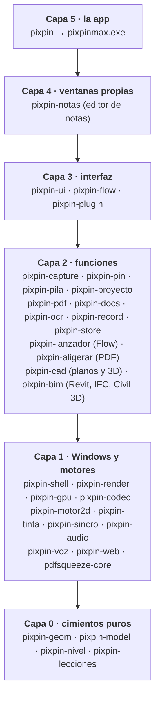
```mermaid
flowchart TB
    L5["<b>Capa 5 · la app</b><br/>pixpin → pixpinmax.exe"]
    L4["<b>Capa 4 · ventanas propias</b><br/>pixpin-notas (editor de notas)"]
    L3["<b>Capa 3 · interfaz</b><br/>pixpin-ui · pixpin-flow · pixpin-plugin"]
    L2["<b>Capa 2 · funciones</b><br/>pixpin-capture · pixpin-pin · pixpin-pila · pixpin-proyecto<br/>pixpin-pdf · pixpin-docs · pixpin-ocr · pixpin-record · pixpin-store<br/>pixpin-lanzador (Flow) · pixpin-aligerar (PDF)<br/>pixpin-cad (planos y 3D) · pixpin-bim (Revit, IFC, Civil 3D)"]
    L1["<b>Capa 1 · Windows y motores</b><br/>pixpin-shell · pixpin-render · pixpin-gpu · pixpin-codec<br/>pixpin-motor2d · pixpin-tinta · pixpin-sincro · pixpin-audio<br/>pixpin-voz · pixpin-web · pdfsqueeze-core"]
    L0["<b>Capa 0 · cimientos puros</b><br/>pixpin-geom · pixpin-model · pixpin-nivel · pixpin-lecciones"]
    L5 --> L4 --> L3 --> L2 --> L1 --> L0
```

| Pieza | Qué hace |
|---|---|
| `pixpin-render`, `pixpin-gpu` | Pintar con Direct2D/DirectWrite sobre un dispositivo D3D11 compartido |
| `pixpin-motor2d`, `pixpin-tinta` | El lienzo (formato de Excalidraw) y el trazo a mano |
| `pixpin-capture`, `pixpin-record`, `pixpin-pila` | Captura, GIF/MP4 y la pila de capturas de la esquina |
| `pixpin-pin` | Las ventanas flotantes: imagen, vídeo, PDF, en vivo, herramientas |
| `pixpin-proyecto`, `pixpin-sincro` | Proyectos en disco (mismo formato que Android) y la sincronización por Wi‑Fi |
| `pixpin-pdf`, `pixpin-docs`, `pdfsqueeze-core` | Leer y anotar PDF, Word y EPUB, y aligerar PDF |
| `pixpin-ocr`, `pixpin-voz`, `pixpin-audio` | Texto de las imágenes, transcripción y audio |
| `pixpin-codec` | Imágenes: `image` y, para HEIC/AVIF/TIFF/RAW, los decodificadores de Windows (WIC) |
| `pixpin-lecciones` | Lecciones aprendidas: buscador, etiquetador y repaso, igual que en Android |
| `pixpin-cad` | El visor de planos DWG/DXF (con su regla, marcos e impresión) y el visor 3D con la GPU |
| `pixpin-bim` | Leer Revit, IFC, LandXML y puntos de Civil 3D: niveles, medidas y terrenos |
| `pixpin-lanzador` | El plugin de Flow Launcher |

La interfaz no usa HTML ni un framework: cada ventana se dibuja con Direct2D, con tema claro y
oscuro según Windows. El diseño de cada parte está en `docs/superpowers/specs/` y las
investigaciones en `docs/investigacion/`.

## Compilar y probar

Hace falta Rust estable (1.85 o superior) en Windows.

```powershell
cargo build --release -p pixpin -p pixpin-aligerar -p pixpin-lanzador
```

Para dejarlo instalado en `%LOCALAPPDATA%\Programs\PixPinMax`, con el acceso del menú Inicio y
el plugin de Flow Launcher:

```powershell
powershell -ExecutionPolicy Bypass -File herramientas\instalar.ps1
```

Las pruebas se pasan en serie, porque una de ellas cuenta la memoria que se pide y en paralelo daría
números falsos:

```powershell
cargo test --workspace --no-fail-fast -- --test-threads=1
```

## Privacidad

- Nada sale del equipo salvo lo que sincronizas con tu propio móvil en tu Wi‑Fi.
- Sin cuentas, sin nube y sin telemetría. Los registros se quedan en la carpeta de datos.
- El OCR y la transcripción se hacen en el propio equipo.

## Licencia

MIT. Las letras incluidas llevan su propia licencia (OFL o MIT), en
`crates/pixpin-render/letras/LICENCIAS.txt`.
