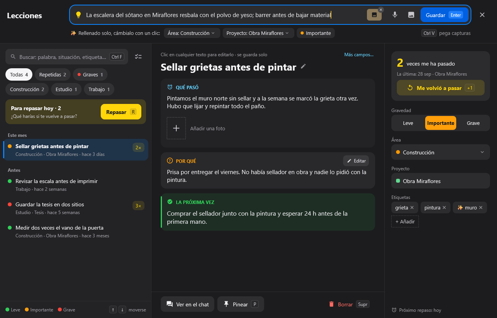
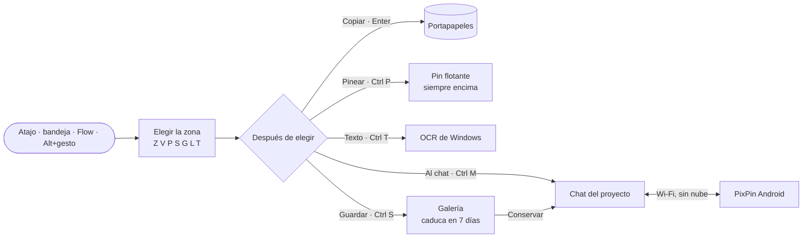
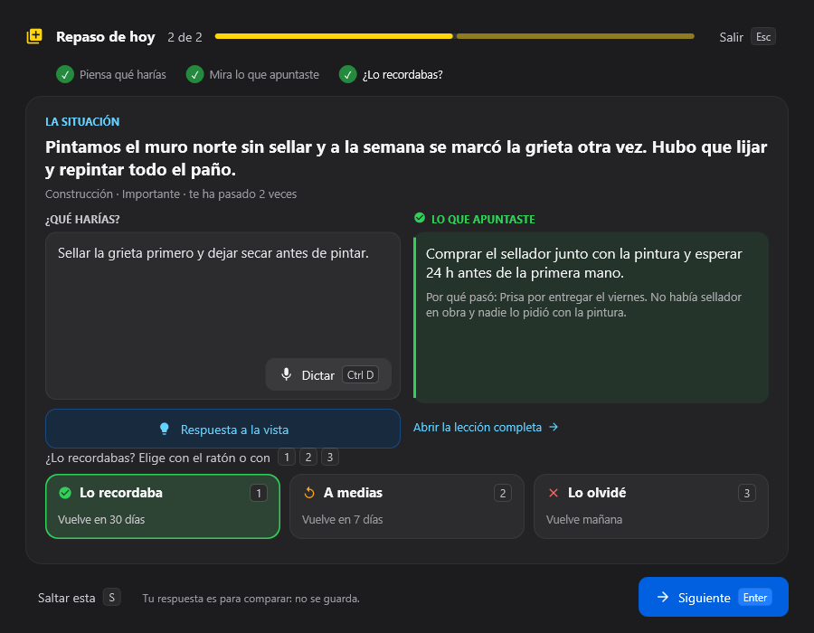
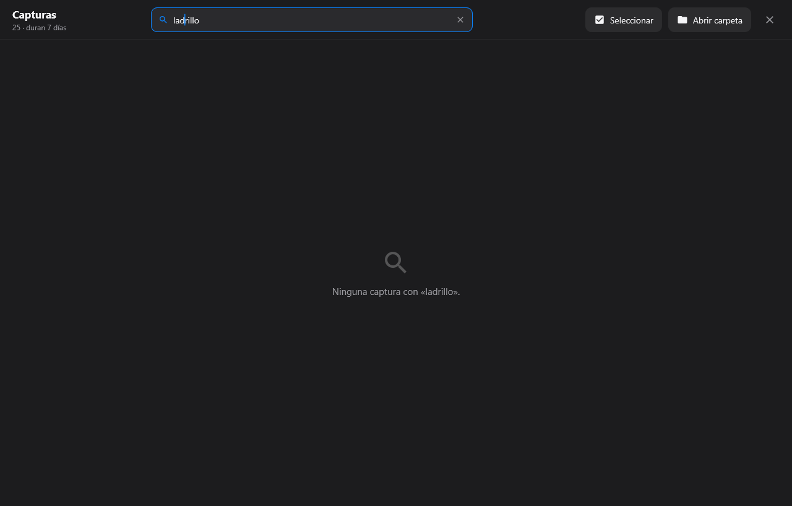
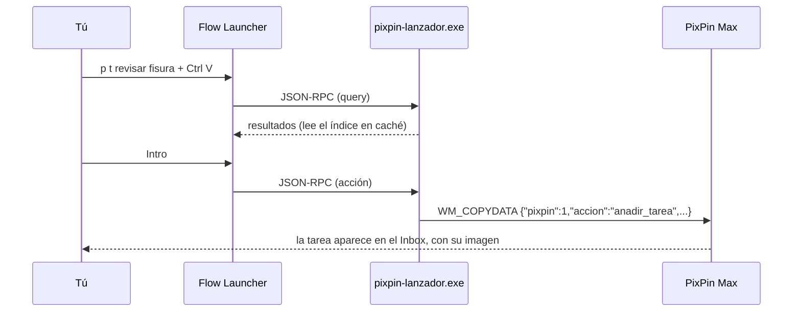
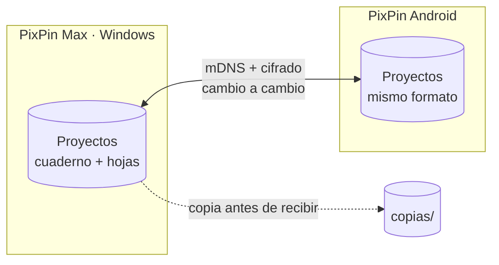
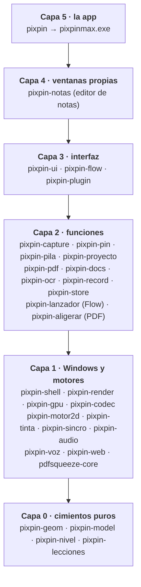

<p align="center">
  
</p>

<p align="center">
  <a href="https://github.com/1xmanMAX/PIXPIN_PRO_WINDOWS/releases"></a>
  
  
  
</p>

<p align="center">
  <b>Captura</b> · <b>Pines flotantes</b> · <b>Chat por proyectos</b> · <b>Lienzo</b> · <b>Tareas</b> · <b>Lecciones</b> · <b>Sincroniza con Android</b>
</p>

---

**PixPin Max** es una app de escritorio para Windows 10 (21H2) y 11. Sirve para capturar la pantalla, dejar cualquier cosa
flotando **siempre encima** (fotos, vídeos, audios, PDF, listas…), dibujar encima y guardarlo todo
ordenado en **proyectos con forma de chat**. Es el hermano de escritorio de **PixPin Android**: lee
y escribe los mismos proyectos y se sincroniza con el móvil por Wi‑Fi, **sin nube y sin cuentas**.

Está escrita en Rust sobre lo que Windows ya trae (Direct2D, DirectWrite, DirectComposition, Media
Foundation, Windows.Media.Ocr, WebView2). Así arranca al instante y va fluida en equipos modestos:
la máquina de referencia es un Core i3 de 3.ª generación con 4 GB.

> [!NOTE]
> El nombre **PixPin** pertenece a DepthPixel. Este proyecto es una implementación personal e
> independiente, igual que su versión Android.

## Índice

- [Un vistazo](#un-vistazo)
- [Qué hace](#qué-hace)
  - [Capturar](#capturar)
  - [Pines flotantes](#pines-flotantes)
  - [Proyectos y chat](#proyectos-y-chat)
  - [Tareas, lecciones y galería](#tareas-lecciones-y-galería)
  - [Buscar en todo](#buscar-en-todo)
  - [La bandeja](#la-bandeja)
  - [El lienzo](#el-lienzo)
  - [Abrir fotos, vídeos y audios](#abrir-fotos-vídeos-y-audios)
  - [Flow Launcher](#flow-launcher)
  - [Sincronizar con el móvil](#sincronizar-con-el-móvil)
  - [Ajustes](#ajustes)
- [Atajos de teclado](#atajos-de-teclado)
- [Instalar](#instalar)
- [Cómo está hecho](#cómo-está-hecho)
- [Compilar y probar](#compilar-y-probar)
- [Privacidad](#privacidad)
- [Licencia](#licencia)

## Un vistazo

| Capturar y anotar sin abrir otra ventana | Buscar en todo PixPin |
|---|---|
|  |  |
| **Lecciones aprendidas** | **Galería de capturas que caducan** |
|  |  |



## Qué hace

### Capturar

Un atajo (de fábrica **Ctrl Alt X**) o la bandeja abren la captura. Abajo sale una barra con cada
modo y su letra; no hace falta recordar más atajos.

| Elegir la zona | Después de elegir |
|---|---|
|  |  |

- **Modos**: Zona `Z`, Ventana `V` (resalta la ventana bajo el ratón con su nombre), Pantalla `P`,
  Con scroll `S`, Grabar GIF `G`, Pin en vivo `L` y Texto con OCR `T`.
- **Medidas exactas** tecleando ancho × alto, proporciones **16:9 · 4:3 · 1:1** y **Repetir la última zona** (`R`).
- **Lupa** con el color en HEX y RGB; `C` lo copia.
- **Después de elegir**: Copiar (azul, `Enter`), Pinear, Al chat (eliges el proyecto en un paso,
  con buscador y teclas 1–6), Texto (OCR) y Guardar.
- **Anotar encima sin abrir otra ventana**: lápiz, flecha, rectángulo, texto y mosaico (teclas
  `1`–`5`), con colores, grosores y deshacer. Lo dibujado entra en la imagen.
- **Gestos con Alt** en cualquier sitio: arrastrar con el izquierdo copia, con el derecho pinea, con
  el central saca un pin en vivo y el doble clic central abre el anotador de pantalla.

### Pines flotantes

Todo lo que se pinea queda **siempre encima**: fotos, vídeos, PDF, notas, listas de tareas,
herramientas (contador, ruleta, gastos…) y **pines en vivo** que copian una zona de la pantalla
en tiempo real.

<table>
  <tr>
    <td width="58%" valign="top">
      <b>Barra común al pasar el ratón</b><br><br>
      <br><br>
      Con su chapita de atajo en cada botón («Copiar Ctrl C»). En un vídeo, el control propio es
      reproducir, la línea de tiempo y el volumen; en un PDF, la página; en un pin en vivo, congelar.
    </td>
    <td width="42%" valign="top">
      <b>Panel «Pines abiertos»</b><br><br>
      
    </td>
  </tr>
</table>

- **La misma barra en todos**: primero su control propio (zoom, página del PDF, reproducir…),
  después Copiar, Anotar y Más; Cerrar aparte.
- **Vídeo con aceleración de la GPU** (Media Foundation sobre Direct3D 11) a la frecuencia del
  monitor, con línea de tiempo, volumen y sonido al abrirlo.
- **Opacidad** del 20 al 100 % (Mayús + rueda), **guías azules** para alinear pines y un imán
  suave al soltar.
- **Pines abiertos**: lista agrupada por color para encontrar los ocultos, mostrar u ocultar
  todos (`Ctrl 2`) y cerrar todos con deshacer.

| Lista de tareas | Gastos |
|---|---|
|  |  |

### Proyectos y chat

Cada proyecto es un chat, como en el móvil: notas, fotos con su descripción, notas de voz,
documentos, PDF, tablas y lienzos. La tarjeta del proyecto enseña la portada y las hojas en
miniatura.

<table>
  <tr>
    <td width="50%" valign="top" rowspan="2">
      <b>Menú de un mensaje</b><br><br>
      
    </td>
    <td width="50%" valign="top">
      <b>Botón de adjuntar</b><br><br>
      
    </td>
  </tr>
  <tr>
    <td valign="top">
      <b>Enviar varias fotos con descripción</b><br><br>
      
    </td>
  </tr>
</table>

- **Menú de cada mensaje** con iconos y letras: Responder `R`, Copiar, Pinear `P`, Anotar `A`,
  Editar descripción `E`, Reenviar `F`, Hacer lección `L`… Lo menos usado va en «Más». Encima,
  las etiquetas ⭐ ✅ ⏳ 💡 💰 📍.
- **Adjuntar** como cuadrícula con buscador y teclas `1`–`8`: foto o vídeo, archivo, lienzo,
  nota, lista de tareas, tabla, conversación y captura. Debajo, lo menos usado: teleprónter,
  pronunciar, cronómetro, ruleta, gastos, traer del móvil…
- **Varias fotos con descripción**: se reordenan arrastrando y se quitan con ✕. El texto
  queda como descripción de la foto y se puede editar después.
- **Cambiar el nombre** de cualquier archivo o audio (`F2`).
- **PDF**: entra como un solo mensaje. Sus páginas son hojas del proyecto que se anotan como
  lienzos, con lectura seguida, marcadores, búsqueda y fusión. `pixpin-aligerar.exe` lo comprime
  en segundo plano.
- **Documentos**: Word, EPUB, HTML, Markdown y texto se leen dentro, con zoom, marcadores y
  tinta. PowerPoint se presenta a pantalla completa y Excel entra como tablas que calculan.
- **Voz**: notas de voz, transcripción con Whisper (sobre el ONNX Runtime de Windows),
  teleprónter, pronunciar y conversación por turnos.

| Proyectos, tema claro | Tema oscuro | Ventana estrecha |
|---|---|---|
|  |  |  |

### Tareas, lecciones y galería

Tres botones redondos junto al buscador del chat abren tres ventanas.

**Tareas**: todas las listas de todos los proyectos en una sola ventana. Lo que se apunta rápido
entra en el **Inbox**, y «Mover a…» lo lleva a la lista que toque. Una tarea puede llevar
imágenes: se pegan con `Ctrl V` y aparecen como `[img 01]`, como en una terminal.

**Lecciones aprendidas**: lo que salió mal (o bien) para que no se repita.

| Ficha en tres bloques | Repaso espaciado |
|---|---|
|  |  |

- La barra **«¿Qué aprendiste?»** reparte la frase y rellena sola el área, el proyecto y la gravedad.
- Cada ficha tiene tres bloques, **Qué pasó · Por qué · La próxima vez**, y se edita con un clic sobre el texto.
- **Repaso** con tres botones: `1` lo recordaba (vuelve en 30 días), `2` a medias (en 7) y `3` lo olvidé (mañana).
- Mismo formato que Android: se sincronizan.

**Galería de capturas**: las capturas hechas en el PC **se borran solas a los 7 días** (van a la
papelera de PixPin y se pueden recuperar), salvo las que conservas.



- Filtros con su número: hoy, esta semana, conservadas, se borran pronto, GIF, vídeos, con texto.
- **Busca también el texto que hay dentro de las capturas** (OCR en segundo plano, con caché).
- La caducidad se ve por colores (gris, naranja, rojo y verde para las conservadas), con
  **Conservar** o **Dar 7 días más**.
- Elegir varias, con barra de acciones; borrar sin preguntar y con **Deshacer** (`Ctrl Z`).

### Buscar en todo

Una ventana para encontrar cualquier cosa: archivos de los chats, tareas, lecciones, capturas y
acciones, con pestañas, vista previa y todo hacible con teclado. Usa el mismo buscador que el
plugin de Flow Launcher, así que da los mismos resultados.

| Antes de escribir | Con resultados |
|---|---|
|  |  |

Las letras rápidas sirven aquí y en Flow: `t` tarea, `n` nota, `l` lienzo, `g` galería,
`c` capturar, `u` última captura, `a` nueva lección.

### La bandeja

Clic izquierdo en el icono de la bandeja: un centro de control con un buscador de acciones,
**Capturar** con sus modos, favoritos que eliges tú, interruptores para los pines y los atajos, las
últimas capturas y acceso a Tareas, Lecciones y la galería. El clic derecho sigue abriendo el menú
clásico.

| Tema oscuro | Tema claro |
|---|---|
|  |  |

### El lienzo

Un puerto de Excalidraw con las herramientas del móvil. La barra va agrupada en una fila: cada
grupo enseña su última herramienta y despliega las demás.

| Barra agrupada | Soldar vértices | Pasos y foco |
|---|---|---|
|  |  |  |

- **Texto sin caja** con ocho letras incluidas (Excalifont, Nunito, Lilita One, Comic Shanns,
  Work Sans, Fraunces, Courier New y Caveat).
- **Tinta**: lápiz, grafito, resaltador, goma y bote de relleno exacto entre figuras.
- **Construir**: recortar y extender, soldar vértices, puntos con letra, cotas, escala gráfica y calibrar.
- **Señalar y tapar**: pasos numerados, foco, lupa, pixelar o desenfocar, láser y marcadores.
- **Gráficas, tablas y cronogramas**; tablas pegadas de Excel o Sheets con celdas combinadas.
- **Zona al chat**: un rectángulo del lienzo va al chat con su vínculo de vuelta.
- **Imprimir y exportar** a PNG, JPG, SVG, PDF y una página web que se puede volver a anotar.

| Gráfica | Tabla | Pixelar | Lupa |
|---|---|---|---|
|  |  |  |  |

### Abrir fotos, vídeos y audios

PixPin puede ser la **app predeterminada** (el instalador abre la página de Windows para elegirla).
Al abrir un archivo sale como ventana flotante, en unos 200 ms:

| Tipo | Formatos | Se abre como |
|---|---|---|
| Fotos | png, jpg, jfif, webp, bmp, gif, tiff, ico, jxr, heic\*, avif\*, jxl\*, RAW | Pin de imagen |
| Vídeos | mp4, mkv, mov, m4v, avi, wmv, mpg, ts, webm\* | Pin de vídeo con la GPU |
| Audios | mp3, m4a, wav, aac, flac, ogg, opus, wma, 3gp, amr | Reproductor flotante, en cola si son varios |
| Documentos | pdf, docx, epub, pptx, md | Su lector |

\* Necesitan la extensión gratuita de Microsoft Store (HEVC, AV1, VP9 o JPEG XL). Si falta, PixPin
dice cuál instalar.

### Flow Launcher

Con [Flow Launcher](https://www.flowlauncher.com/) se usa PixPin sin abrirla: escribe **`p`**.

```
p t comprar sellador [img 01]   → tarea al Inbox, con la imagen pegada (Ctrl V)
p n idea para la tesis          → nota nueva
p g muro                        → buscar en la galería (también por el texto de dentro)
p a revisar la escala           → lección nueva
p lecciones grietas             → buscar lecciones
p c                             → capturar una zona
```



El protocolo está documentado en [`docs/protocolo-pedidos.md`](docs/protocolo-pedidos.md):
cualquier programa puede pedirle cosas a PixPin.

### Sincronizar con el móvil

Por Wi‑Fi, sin nube. Los equipos se encuentran por mDNS y juntan los cambios uno a uno. También
puede mandar uno («Lo mío manda»). Antes de borrar se pregunta y antes de recibir se hace copia de
seguridad.



- Lo anotado sobre PDF, Word y EPUB viaja en las dos direcciones: tinta, marcadores y espacios
  para anotar. Hace falta PixPin Android 0.96 o superior.
- Un lienzo enviado desde el PC se abre en el lienzo del móvil y al revés.
- Las lecciones se juntan campo a campo.

### Ajustes

Todo lo que antes solo estaba en el archivo de ajustes tiene ahora su control, con un buscador,
una explicación en cada opción y un **punto azul** en lo que has cambiado. Cada opción o sección
se puede restablecer.


## Atajos de teclado

Solo hay **un atajo general** (capturar, de fábrica `Ctrl Alt X`) y los gestos con Alt. El resto
son letras que **solo valen dentro de la ventana abierta**, y cada botón muestra la suya.

| Dónde | Teclas |
|---|---|
| En todo Windows | `Ctrl Alt X` capturar · `Alt`+arrastrar: izquierdo copia, derecho pinea, central pin en vivo · `Alt`+doble clic central: anotar pantalla · `Ctrl 2` ocultar los pines |
| Al capturar | `Z` `V` `P` `S` `G` `L` `T` modos · `R` repetir la zona · `C` copiar el color · `1`–`5` herramientas · `Enter` copiar · `Ctrl P` pinear · `Ctrl M` al chat · `Ctrl T` texto · `Ctrl S` guardar · `Esc` salir |
| En un pin | `A` anotar · `Ctrl C` copiar · `Ctrl 0` tamaño original · `Ctrl T` dejar pasar el clic · `Mayús`+rueda opacidad · `Espacio` pausa (vídeo) · `M` silencio |
| En el chat | `R` `P` `A` `E` `F` `L` en el menú de un mensaje · `F2` cambiar el nombre · `1`–`8` en adjuntar |
| Galería | flechas · `Espacio` elegir · `Enter` pinear · `Ctrl S` conservar · `Supr` borrar · `Ctrl Z` deshacer |
| Lecciones | `Ctrl F` buscar · `R` repasar · `1` `2` `3` en el repaso · `S` saltar |

## Instalar

1. Descarga el ZIP de la última versión en [Releases](https://github.com/1xmanMAX/PIXPIN_PRO_WINDOWS/releases).
2. Descomprímelo y ejecuta `pixpinmax.exe`. Se queda en la bandeja y arranca con Windows.
3. Opcional: en **Ajustes → Apps predeterminadas** elige PixPin para fotos, vídeos y audios.

**Modo portable**: si junto a `pixpinmax.exe` hay un `pixpinmax.toml`, todo se guarda en esa
carpeta y nada en el registro, así que se puede llevar en un USB.

## Cómo está hecho

Un espacio de trabajo de Rust con **tres ejecutables** y **28 crates por capas**. Una prueba
(`apps/pixpin/tests/capas.rs`) comprueba que ningún crate dependa de uno de su misma capa o de
una capa superior.



| Pieza | Qué hace |
|---|---|
| `pixpin-render`, `pixpin-gpu` | Pintar con Direct2D/DirectWrite sobre un dispositivo D3D11 compartido |
| `pixpin-motor2d`, `pixpin-tinta` | El lienzo (formato de Excalidraw) y el trazo a mano |
| `pixpin-capture`, `pixpin-record`, `pixpin-pila` | Captura, GIF/MP4 y la pila de capturas de la esquina |
| `pixpin-pin` | Las ventanas flotantes: imagen, vídeo, PDF, en vivo, herramientas |
| `pixpin-proyecto`, `pixpin-sincro` | Proyectos en disco (mismo formato que Android) y la sincronización por Wi‑Fi |
| `pixpin-pdf`, `pixpin-docs`, `pdfsqueeze-core` | Leer y anotar PDF, Word y EPUB, y aligerar PDF |
| `pixpin-ocr`, `pixpin-voz`, `pixpin-audio` | Texto de las imágenes, transcripción y audio |
| `pixpin-codec` | Imágenes: `image` y, para HEIC/AVIF/TIFF/RAW, los decodificadores de Windows (WIC) |
| `pixpin-lecciones` | Lecciones aprendidas: buscador, etiquetador y repaso, igual que en Android |
| `pixpin-lanzador` | El plugin de Flow Launcher |

La interfaz no usa HTML ni un framework: cada ventana se dibuja con Direct2D, con tema claro y
oscuro según Windows. El diseño de cada parte está en `docs/superpowers/specs/` y las
investigaciones en `docs/investigacion/`.

## Compilar y probar

Hace falta Rust estable (1.85 o superior) en Windows.

```powershell
cargo build --release -p pixpin -p pixpin-aligerar -p pixpin-lanzador
```

Para dejarlo instalado en `%LOCALAPPDATA%\Programs\PixPinMax`, con el acceso del menú Inicio y
el plugin de Flow Launcher:

```powershell
powershell -ExecutionPolicy Bypass -File herramientas\instalar.ps1
```

Las pruebas se pasan en serie, porque una de ellas cuenta la memoria que se pide y en paralelo daría
números falsos:

```powershell
cargo test --workspace --no-fail-fast -- --test-threads=1
```

## Privacidad

- Nada sale del equipo salvo lo que sincronizas con tu propio móvil en tu Wi‑Fi.
- Sin cuentas, sin nube y sin telemetría. Los registros se quedan en la carpeta de datos.
- El OCR y la transcripción se hacen en el propio equipo.

## Licencia

MIT. Las letras incluidas llevan su propia licencia (OFL o MIT), en
`crates/pixpin-render/letras/LICENCIAS.txt`.
