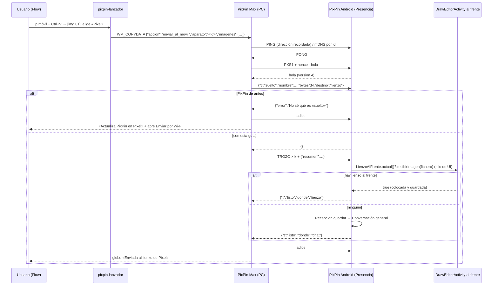

# Una foto del PC al lienzo abierto del móvil — qué hacer en Android

6-oct-2026. Lo pidió el usuario: «en el plugin (Flow Launcher) que haya una función de enviar
una foto directamente a la app del celular: en el celular la app estará en un canvas y al
enviar la foto se enviará directamente a ese canvas **sin que la pestaña de sincronizar esté
abierta**; en el chat del plugin pueda yo pegar la imagen y elegir el dispositivo entre los
dispositivos sincronizados dentro del grupo, y que se envíe rápidamente y se inserte en el
canvas que estoy trabajando en ese momento».

En el PC **ya está todo**: el plugin (`p móvil` + Ctrl+V → una fila por aparato del grupo), el
pedido `enviar_al_movil`, el cliente que localiza al móvil y le manda la foto, y los avisos.
Lo que falta es que el móvil entienda una petición nueva, `suelto`, y la meta en el lienzo que
tiene delante. Este documento dice **el mensaje exacto** y **qué tocar en Android, con rutas y
líneas** (v0.104.3, `versionCode` 199).

> **No hay que subir el protocolo.** Sigue en `VERSION = 4`. `suelto` es una petición opcional
> más: un móvil de hoy la contesta con su «No sé qué es «suelto»» de siempre, el PC lo reconoce,
> dice «Actualiza PixPin en <móvil>» y abre el envío por Wi-Fi de siempre. Nada se rompe.

## 1. Por qué así (y no con el envío por código)

- **Ya hay alguien escuchando.** `sincro/Presencia.kt:69-92` escucha en TCP 47474 y se anuncia
  por mDNS (`_pixpin._tcp.`, TXT `g`/`id`/`l`/`n`) **mientras cualquier pantalla de PixPin está
  a la vista**, y 60 s más. No hace falta abrir Sincronizar, ni un código, ni un QR: es lo que
  pidió el usuario.
- **Ya está cifrado y autenticado.** El mismo `Canal` (PXS1 + nonces, AES-GCM por sentido) con la
  clave del grupo (`Identidad.kt:84-87`). Solo un aparato del grupo puede mandar fotos.
- **Ya se sabe trocear un archivo.** `Protocolo.recibirTrozos` (`Protocolo.kt:194-208`) con su
  cola de resumen; el PC manda los trozos con el mismo `Salida` que en `pon`.

## 2. El mensaje, exacto

Tras abrir el canal, todo como una sincronización: el PC manda `hola` y el móvil contesta su
`hola` (con su `version: 4`). Luego, **por cada imagen**:

```text
PC  → JSON  {"t":"suelto","nombre":"captura.png","mime":"image/png","bytes":48213,"destino":"lienzo"}
mov → JSON  {}                                       ← «vale, mándala»   (o {"error":"…"})
PC  → TROZO … TROZO                                  ← 48213 bytes, tramos de ≤ 1 MiB
PC  → JSON  {"resumen":"<sha256 hex de los bytes>"}   ← la cola de siempre (o "saltado":true)
mov → JSON  {"t":"listo","donde":"lienzo"}           ← o "donde":"chat"   (o {"error":"…"})
```

Y al acabar, `{"t":"adios"}` → `{}` como siempre. Varias imágenes = varias `suelto` seguidas en
la **misma** conexión.

| Campo de `suelto` | Qué es |
|---|---|
| `t` | `"suelto"` |
| `nombre` | El nombre del fichero en el PC (`captura.png`, `img-1759….bmp`). Solo para enseñarlo y para la extensión: **sanearlo** antes de usarlo en una ruta (`Envio.nombreSano` o equivalente). |
| `mime` | `image/png`, `image/jpeg`, `image/gif`, `image/webp`, `image/bmp`, o `application/octet-stream` si no es una imagen. |
| `bytes` | Lo que van a medir los trozos, exacto. |
| `destino` | Hoy siempre `"lienzo"`. Se escribe para que otro destino futuro no necesite otra petición. |

Respuestas:

| Momento | Respuesta | Qué hace el PC |
|---|---|---|
| tras `suelto` | `{}` (un `Respuesta()` vacío) | manda los trozos y la cola |
| tras `suelto` | `{"error":"No sé qué es «suelto»"}` (el `else` de hoy, `Protocolo.kt:376`) | **no manda trozos**; aviso «Actualiza PixPin en <móvil>» y abre «Enviar por Wi-Fi» |
| tras `suelto` | `{"error":"Está sincronizando con otro aparato…"}` (`Protocolo.OCUPADO`) | aviso «<móvil> está sincronizando…» |
| tras `suelto` | `{"error":"La imagen es demasiado grande"}` (más de 64 MiB) | aviso con ese motivo; no manda trozos |
| tras la cola | `{"t":"listo","donde":"lienzo"}` | «Enviada al lienzo de <móvil>» |
| tras la cola | `{"t":"listo","donde":"chat"}` | «<móvil> la guardó en el chat (no tenía un lienzo abierto)» |
| tras la cola | `{"error":"…"}` | «No se pudo enviar a <móvil>: …» |

**Por qué el «vale» va antes de los trozos** (y no detrás de la petición, como en `pon`): si el
PC los mandara seguidos, un móvil de hoy contestaría «No sé qué es» y su siguiente
`leerPeticion` (`Protocolo.kt:118-122`) se encontraría un TROZO, lanzaría `IOException` y
cortaría a medias. Con el «vale» delante, un móvil viejo solo ve una petición desconocida y la
conversación sigue sana hasta el `adios`.

Lo que **no** cambia: el `hola` (el PC manda `yo`, `miembros`, `reloj` y su `puerto`; el
`Respondedor` junta los miembros como siempre), `Canal`, `TOPE_DE_TRAMO`, la cola, el puerto.



## 3. Qué hacer en Android

### (a) `sincro/Protocolo.kt`: los campos y el brazo `"suelto"`

1. **`Peticion`** (`Protocolo.kt:72-89`): tres campos nuevos, con valor por omisión (así un PC
   viejo que no los manda sigue entendiéndose, y `encodeDefaults = false` no los escribe):

   ```kotlin
   /** `suelto`: el nombre del fichero, su tipo y adónde lo quiere quien lo manda. */
   val nombre: String? = null,
   val mime: String? = null,
   val destino: String? = null
   ```

2. **`Respuesta`** (`Protocolo.kt:92-112`): dos campos nuevos:

   ```kotlin
   /** Tras un `suelto`: "listo". */
   val t: String? = null,
   /** Dónde quedó la foto: "lienzo" o "chat". */
   val donde: String? = null
   ```

3. **`Respondedor`** (`Protocolo.kt:225-234`): un parámetro más, **opcional**, para no meter
   `Context` ni pantallas en el protocolo (y que las pruebas JVM sigan sin Android):

   ```kotlin
   /**
    * Una foto suelta del PC (`suelto`): recibe el fichero ya entero en caché, su nombre, su tipo
    * y quién la manda, y devuelve dónde quedó ("lienzo" o "chat"). Sin esto, `suelto` se contesta
    * como cualquier petición desconocida.
    */
   private val alRecibirSuelto: ((java.io.File, String, String, Aparato) -> String)? = null,
   /** Dónde dejar el fichero mientras llega. */
   private val cache: java.io.File? = null
   ```

4. **El brazo**, en el `when (p.t)` de `responder` (`Protocolo.kt:288-376`), antes del `else`:

   ```kotlin
   "suelto" -> {
       val recibir = alRecibirSuelto
       val carpeta = cache
       when {
           // Como hoy: el PC lo reconoce y ofrece el envío de siempre.
           recibir == null || carpeta == null ->
               Protocolo.enviar(canal, Protocolo.Respuesta(error = "No sé qué es «${p.t}»"))
           // Sin «vale» no sale ningún trozo: basta con decirlo.
           p.bytes < 0 || p.bytes > TOPE_DE_SUELTO ->
               Protocolo.enviar(canal, Protocolo.Respuesta(error = "La imagen es demasiado grande"))
           else -> {
               val nombre = Envio.nombreSano(p.nombre ?: "imagen.png")   // o el saneado que ya se use
               val fichero = java.io.File(carpeta, "suelto_${System.currentTimeMillis()}_$nombre")
               Protocolo.enviar(canal, Protocolo.Respuesta())            // «vale»: {}
               estado("Recibiendo ${nombre} de ${otro.nombre}")
               val entero = fichero.outputStream().use { Protocolo.recibirTrozos(canal, p.bytes, it) {} } != null
               if (!entero) {
                   fichero.delete()
                   Protocolo.enviar(canal, Protocolo.Respuesta(error = "La imagen cambió mientras se mandaba"))
               } else {
                   val donde = recibir(fichero, nombre, p.mime ?: "application/octet-stream", otro)
                   Protocolo.enviar(canal, Protocolo.Respuesta(t = "listo", donde = donde))
               }
           }
       }
   }
   ```

   con `const val TOPE_DE_SUELTO = 64L shl 20` en `Protocolo`. Si `recibir` lanza, el `catch`
   genérico de `responder` (`Protocolo.kt:377-381`) ya contesta `{"error": …}` y sigue: bien. El
   fichero de caché lo borra quien lo usa (abajo) o, si nadie, el `delete` de la (c).

   Nota: el `Respondedor` hace `Protocolo.ocupar(disco)` tras el `hola` (`Protocolo.kt:266`).
   Mientras el móvil sincroniza con otro, a `suelto` le toca «ocupado»: está bien, el PC lo dice
   con esas palabras. No hace falta saltárselo.

### (b) El lienzo al frente: `LienzoAlFrente` + `DrawEditorActivity.recibirImagen`

Hoy nadie sabe qué lienzo está delante (`data/LienzosAbiertos.kt` es la tira de la multitarea,
no «el de ahora»). Hace falta un registro mínimo:

```kotlin
package com.forge.pixpin.motor

/** Lo que sabe meter una imagen en lo que se está mirando. Interfaz para probarlo sin Android. */
interface RecibeImagenes { fun recibirImagen(archivo: java.io.File, mime: String): Boolean }

/**
 * **El lienzo que el usuario tiene delante ahora mismo**, para meterle lo que llega del PC.
 * Débil: si la pantalla se destruye sin pasar por `onPause` no se queda colgada en memoria.
 */
object LienzoAlFrente {
    @Volatile private var ref: java.lang.ref.WeakReference<RecibeImagenes>? = null
    fun poner(l: RecibeImagenes) { ref = java.lang.ref.WeakReference(l) }
    /** Solo quita si es el mismo: al pasar de un lienzo a otro, el `onResume` del nuevo llega antes que el `onPause`… o después; así da igual el orden. */
    fun quitar(l: RecibeImagenes) { if (ref?.get() === l) ref = null }
    fun actual(): RecibeImagenes? = ref?.get()
}
```

En **`motor/DrawEditorActivity.kt`** (`class DrawEditorActivity : ComponentActivity()`, línea 179):

1. `class DrawEditorActivity : ComponentActivity(), RecibeImagenes`.
2. **No tiene `onResume`**: añadirlo, y en `onPause` (línea 1163) quitarse **lo primero**:

   ```kotlin
   override fun onResume() { super.onResume(); LienzoAlFrente.poner(this) }
   override fun onPause() {
       LienzoAlFrente.quitar(this)
       guardarLosDeLaTira()
       …lo de hoy…
   }
   ```

3. **La función pública**, al lado de `colocarImagenElegida` (línea 5210), que hace lo mismo
   pero desde un `File`, **en el hilo de UI**, centrada en lo que se mira (no a +200 del
   origen visible como hoy) y **a una escala que quepa**: una foto de 4000 px pegada a 1:1 tapa
   el lienzo entero.

   ```kotlin
   /**
    * **Una imagen que llega del PC** (`suelto`, ver `sincro/Protocolo.kt`). Mismo camino que una
    * foto elegida ([colocarImagenElegida]): así se arrastra, se gira y se exporta como las demás.
    * Se pone en el centro de lo que se mira y, si es más grande, cabe en el 60 % de la vista.
    * Llamar en el hilo de UI. Devuelve si quedó puesta.
    */
   override fun recibirImagen(archivo: File, mime: String): Boolean = runCatching {
       val file = ExcalidrawStore.guardarImagen(this, archivo, mime) ?: return false
       val bmp = ImageStore.load(file.path) ?: return false
       bitmaps[file.id] = bmp
       val v = controller.scene.viewport
       val ancho = medidaDelLienzo.width.takeIf { it > 0 }?.toDouble() ?: resources.displayMetrics.widthPixels.toDouble()
       val alto = medidaDelLienzo.height.takeIf { it > 0 }?.toDouble() ?: resources.displayMetrics.heightPixels.toDouble()
       val a = v.toScene(0.0, 0.0)
       val b = v.toScene(ancho, alto)
       val escala = minOf(1.0, 0.6 * (b.x - a.x) / bmp.width, 0.6 * (b.y - a.y) / bmp.height)
       val w = bmp.width * escala
       val h = bmp.height * escala
       val c = v.toScene(ancho / 2, alto / 2)
       controller.placeImage(file, at = Pt(c.x - w / 2, c.y - h / 2), width = w, height = h)
       guardar()
       true
   }.getOrDefault(false)
   ```

   (Es el centro que ya usa `insertarLaHojita`, línea 5175, con `medidaDelLienzo`, línea 622.)
   Si la imagen no aparece hasta tocar la pantalla, hacer lo mismo que haga
   `colocarImagenElegida` para repintar (si hay que subir el `tick` de Compose, subirlo aquí).

### (c) Sin lienzo al frente: a la Conversación general

En **`sincro/Presencia.kt:78-83`**, donde se crea el `Respondedor`, pasarle el gancho y la caché:

```kotlin
Respondedor(
    disco,
    estado = { atendiendo.value = it },
    miPuerto = red.puerto,
    alSaludar = { otro, puerto -> disco.apuntarDireccion(otro.id, quien, puerto) },
    cache = app.cacheDir,
    alRecibirSuelto = { fichero, nombre, mime, otro -> alLienzoOAlChat(fichero, nombre, mime, otro) }
)
```

y en `Presencia`:

```kotlin
/** Una foto suelta del PC: al lienzo que esté delante; si no hay, a la Conversación general. */
private fun alLienzoOAlChat(fichero: File, nombre: String, mime: String, otro: Aparato): String {
    try {
        val lienzo = com.forge.pixpin.motor.LienzoAlFrente.actual()
        if (lienzo != null && mime.startsWith("image/")) {
            val hecho = java.util.concurrent.CountDownLatch(1)
            var puesta = false
            principal.post { puesta = lienzo.recibirImagen(fichero, mime); hecho.countDown() }
            if (hecho.await(10, java.util.concurrent.TimeUnit.SECONDS) && puesta) {
                apuntar("Foto de ${otro.nombre} puesta en el lienzo")
                return "lienzo"
            }
        }
        val e = Envio.Elemento(
            tipo = Envio.ARCHIVO, nombre = nombre, bytes = fichero.length(), mime = mime,
            // Única por envío: con la misma identidad, `guardarArchivo` SUSTITUIRÍA la anterior.
            identidad = "suelto:${otro.id}:${System.currentTimeMillis()}:$nombre"
        )
        Recepcion.guardar(app, e, fichero, Envio.Oferta(de = otro.nombre, deId = otro.id, elementos = emptyList()))
            ?: throw java.io.IOException("No se pudo guardar la imagen")
        apuntar("Foto de ${otro.nombre} guardada en la conversación general")
        return "chat"
    } finally {
        fichero.delete()   // `guardarImagen` y `copiarAdjunto` ya hicieron su copia
    }
}
```

`Recepcion.guardar` (`Recepcion.kt:148-158`) → `guardarArchivo` (`:254-281`) es justo lo que hace
hoy un archivo recibido por envío: va a la Conversación general como `Clase.IMAGEN`, con
«recibido de <PC>». Un `archivos` del PC que no sea imagen cae siempre aquí.

Comprobar que `ExcalidrawStore.guardarImagen` **copia** el fichero (en `colocarImagenElegida` se
borra el temporal justo después, así que sí); si lo moviera, quitar el `delete` del `finally`.

### (d) Cuándo funciona

- **Solo con PixPin a la vista** (cualquier pantalla) y hasta 60 s después de salir: es cuando
  `Presencia` escucha y se anuncia (`Presencia.kt:44-56`). Con la pantalla apagada o PixPin
  cerrado, el PC dice «<móvil> no está abierto: abre PixPin en el móvil». No hace falta tener
  Sincronizar abierta, que es lo que pidió el usuario.
- Para que vaya **al lienzo**, el lienzo tiene que estar delante (`DrawEditorActivity` en
  `onResume`). Con otra pantalla delante (el chat, los proyectos) va a la conversación general.
- `Red.escuchar` (`Red.kt:61-90`) atiende las conexiones de una en una (`enParalelo = false`):
  si en ese momento hay una sincronización en marcha, la foto espera a que acabe (o recibe
  «ocupado»). Es lo esperado.
- El PC encuentra al móvil por su última dirección (`sincro/direcciones.txt`) con un PING y, si
  cambió de IP, por el mDNS con el `id` del TXT: no hay nada nuevo que anunciar.

### (e) Pruebas a escribir en Android (`app/src/test/java/com/forge/pixpin/sincro/`)

Un `SueltoTest.kt` con dos `Socket` locales o `PipedInputStream`/`PipedOutputStream` y el
`Canal` de verdad (como `SincronizarConElPcTest`):

1. **una_foto_llega_entera_y_va_al_lienzo**: `Respondedor` con `alRecibirSuelto` de mentira que
   devuelve `"lienzo"`; el cliente manda `hola`, `suelto` (1 MiB + 777 bytes, para que vaya en
   dos trozos), los trozos y la cola. Se espera `{}`, luego `{"t":"listo","donde":"lienzo"}`, y
   el fichero que recibe el gancho tiene los mismos bytes.
2. **varias_fotos_en_la_misma_conexion**: dos `suelto` seguidas y `adios`; el gancho se llama dos
   veces, en orden.
3. **caso negativo: sin gancho se contesta como hoy**: `Respondedor` sin `alRecibirSuelto` →
   `{"error":"No sé qué es «suelto»"}` y, **sin mandar trozos**, `adios` → `{}` (la conversación
   sigue sana).
4. **caso negativo: demasiado grande**: `bytes = 65 MiB` → error y ningún trozo leído; el
   `adios` siguiente funciona.
5. **caso negativo: saltado**: la cola con `"saltado":true` → `{"error":…}`, el gancho no se
   llama y no queda fichero en la caché.
6. **el JSON del PC se entiende tal cual**: decodificar
   `{"t":"suelto","nombre":"c.png","mime":"image/png","bytes":5,"destino":"lienzo"}` (es el de la
   prueba `la_peticion_y_las_respuestas_son_las_de_la_guia` del PC) y comprobar los campos; y que
   `Respuesta(t = "listo", donde = "chat")` se codifica como `{"t":"listo","donde":"chat"}`.
7. **`LienzoAlFrente`** (con un `RecibeImagenes` de mentira): `poner(a)`, `quitar(b)` no quita a
   `a`; `quitar(a)` sí. Caso negativo: tras soltar la única referencia y un `System.gc()`,
   `actual()` puede volver `null` sin fallar.

El lado del PC tiene las mismas pruebas contra un «móvil de mentira» que hace lo de esta guía
(`crates/pixpin-sincro/src/al_lienzo.rs`, `apps/pixpin/src/sincronizar/al_movil.rs`): si Android
contesta como dice §2, el PC funciona sin tocar nada.

### (f) ¿Subir el protocolo? No

`VERSION` sigue en 4 en los dos lados. `suelto` es opcional: el PC no lo manda nunca en una
vuelta de sincronizar, solo en esta conexión aparte; un móvil viejo lo contesta con su error de
siempre y un PC viejo nunca lo manda. Subir a 5 rompería la sincronización entre un móvil y un
PC que no se actualicen a la vez (la comprobación es estricta, `lib.rs` del PC), por una función
que no la necesita.

## 4. Dónde está en el PC

- `crates/pixpin-sincro/src/al_lienzo.rs`: el mensaje (`Suelto`, `Contestacion`, `Donde`), el
  cliente (`Conexion::abrir`, `mandar`, `adios`), el lado que recibe (`responder`, modelo de lo de
  §3a) y sus pruebas con un móvil de mentira en 127.0.0.1 (nuevo, viejo, ocupado, otra versión,
  otro código).
- `crates/pixpin-sincro/src/protocolo.rs`: `Salida::de_fichero` (los trozos y la cola de `pon`
  para un fichero que no es de ningún chat).
- `apps/pixpin/src/sincronizar/al_movil.rs`: `aparatos` (los del grupo menos este PC),
  `enviar` (en su hilo: localizar por la dirección recordada y el mDNS, mandar, avisar en el
  globo; con un móvil viejo, «Enviar por Wi-Fi»).
- `apps/pixpin/src/pedidos.rs` + `docs/protocolo-pedidos.md`: el pedido `enviar_al_movil` (y
  `ventana {cual:"sincronizar"}`).
- `apps/pixpin-lanzador/src/al_movil.rs`: `p móvil` / `enviar` / `celular` / `m` en Flow.
